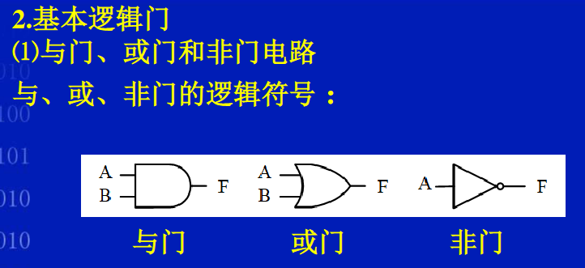
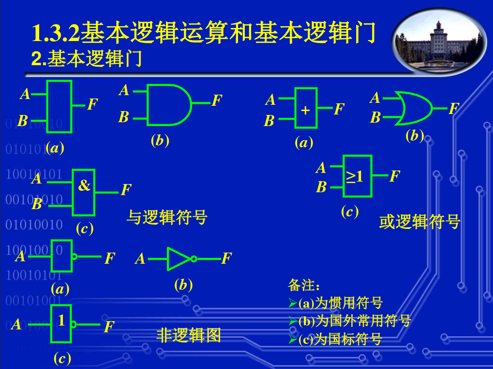
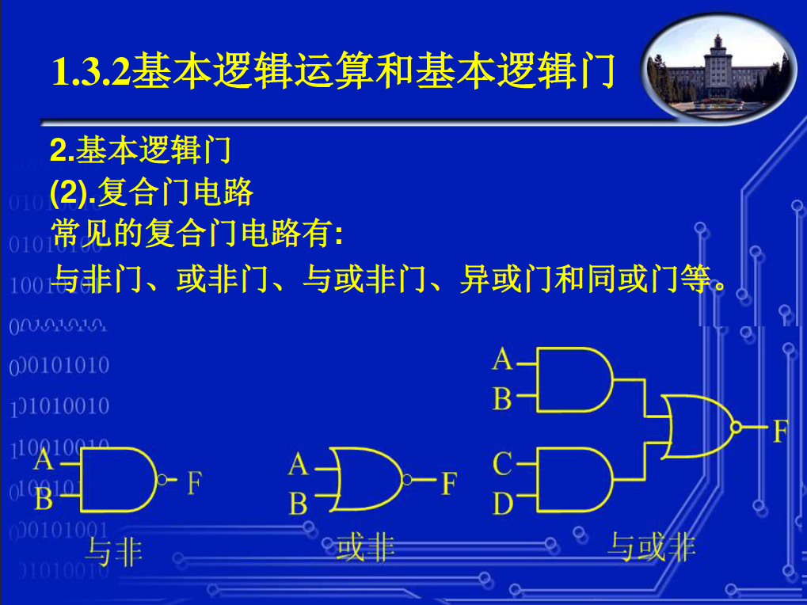
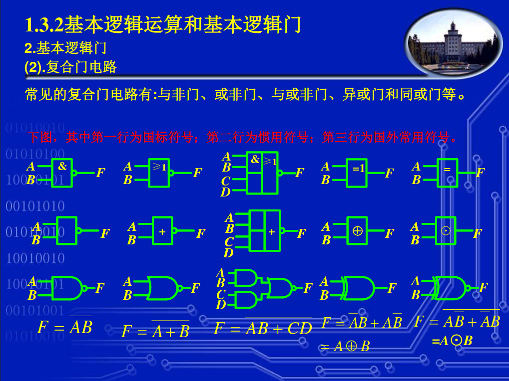
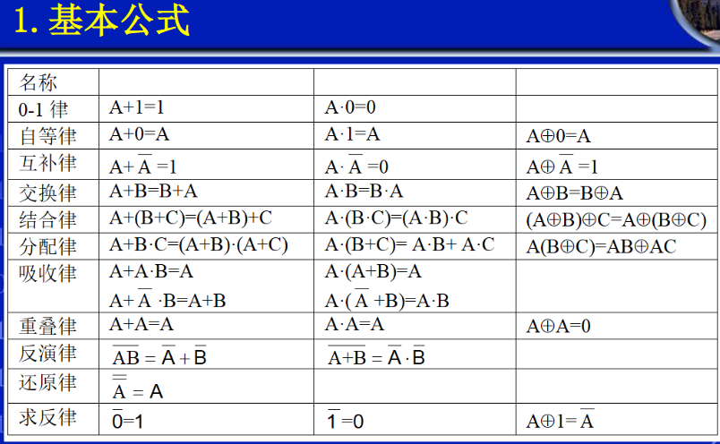
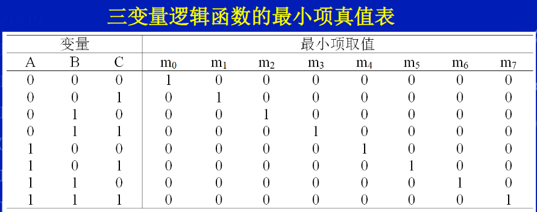
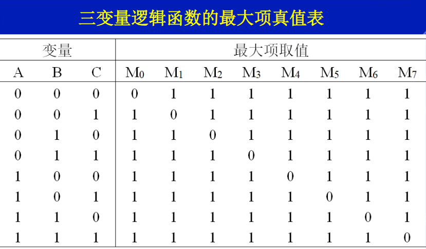
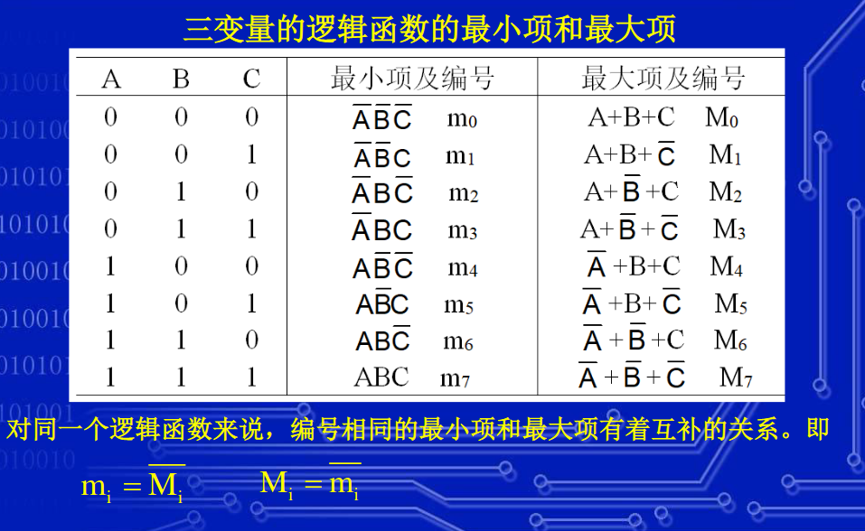

# 介绍

## 数制

十进制、二进制、十六进制

用一组固定的符号和统一的规则来表示数值的方法。

如果按照进位的方法进行计数，则称为进位计数制。

在进位计数制中，数的表示涉及到两个基本问题：

- 权
    - 权是一个与相应数位有关的常数，与该数位的数码相乘后，得到该数位的数码代表的数值。一个数码处于不同的数位时，代表的数值不相同，因为它拥有的权不同
- 基数
    - 基数是一个正整数，它等于相邻数位上权的比

### R 进制数字

$$(a_n \dots a_1.a_{-1} \dots a_{-k})_R = \sum_{i=-k}^n{a_i*R^i}$$

### 数制转换

对于二进制,八进制,十六进制之间转换，我们每一个十六进制数字对应2个八进制数字，4个二进制数字。

|二进制|八进制|十六进制|
|-|-|-|
|0b0000|000|0x0|
|0b0001|001|0x1|
|0b0010|002|0x2|
|0b0011|003|0x3|
|0b0100|004|0x4|
|0b0101|005|0x5|
|0b0110|006|0x6|
|0b0111|007|0x7|
|0b1000|010|0x8|
|0b1001|011|0x9|
|0b1010|012|0xA|
|0b1011|013|0xB|
|0b1100|014|0xC|
|0b1101|015|0xD|
|0b1110|016|0xE|
|0b1111|017|0xF|

0xF   A   3   5    => 0xFA35
 017  12  03  05   => 017120305
0b1111101000110101 => 0b1111101000110101

0xFA35 == 017120305 == 0b1111101000110101

### 十进制转换成 R 进制

**整数（$D_1$）**：

$D_1 / R$ 得到余数 $a_1$，商 $D_2$

$D_2 / R$ 得到余数 $a_2$，商 $D_3$

$\dots$

$D_n / R$ 得到余数 $a_n$，商 $0$

那么R进制数字为

$(a_n \dots a_2a_1)_R$

**小数（$0.d_1$）**：

$0.d_1 * R$ 得到 $b_1.d_2$

$0.d_2 * R$ 得到 $b_2.d_3$

$\dots$

$0.d_n * R$ 得到 $b_n.0$

那么R进制数字为

$(0.b_1b_2 \dots b_n)_R$

无限小数处理类似，不过结果也应该为无限小数。

## 常用编码

十进制编码、循环码、独热码、奇偶校验码等

### 8421码

最常用的一种十进制数编码，也叫 BCD 码（Binary Coded Decimal）。

它是用四位二进制数来表示一位十进制数，每一位都有固定的权，它属于恒权代码。

不能产生正确的进位信号，需要修正电路。

从左到右，各位的权依次为：$2^3$、$2^2$、$2^1$、$2^0$，即8、4、2、1。

|十进制数字|BCD码|
|-|-|
|0|0000|
|1|0001|
|2|0010|
|3|0011|
|4|0100|
|5|0101|
|6|0110|
|7|0111|
|8|1000|
|9|1001|

### 余3码

即 BCD 码+3的二进制。

能产生正确的进位信号。

|十进制数字|BCD码|余3码|
|-|-|-|
|0|0000|0011|
|1|0001|0100|
|2|0010|0101|
|3|0011|0110|
|4|0100|0111|
|5|0101|1000|
|6|0110|1001|
|7|0111|1010|
|8|1000|1011|
|9|1001|1100|

### 四位循环码

循环码，又叫做格雷码，具有多种编码形式，但是都有一个共同的特点，即任意两个相邻的循环码仅有一位编码不同。

循环码是一种**无权码**，每一位都按照一定的规律循环。例如下方四位循环码：

|十进制|二进制|循环码|
|-|-|-|
| 0|0000|0000|
| 1|0001|0001|
| 2|0010|0011|
| 3|0011|0010|
| 4|0100|0110|
| 5|0101|0111|
| 6|0110|0101|
| 7|0111|0100|
| 8|1000|1100|
| 9|1001|1101|
|10|1010|1111|
|11|1011|1110|
|12|1100|1010|
|13|1101|1011|
|14|1110|1001|
|15|1111|1000|

可以看出，四位循环码存在一个“对称轴”，对称轴上方和下方的编码除了最高位是互补的以外，其余各个数位都是以对称轴为中线镜像对称的。

### 独热码（One-hot Code）

独热码(One-hot Code)又称一位有效编码，其方法是使用N位状态寄存器来对N个状态进行编码，每个状态都有它独立的寄存器位，并且在任意时候，其中只有一位有效。

例如：

|二进制|独热码|
|-|-|
|000|00000001|
|001|00000010|
|010|00000100|
|011|00001000|
|100|00010000|
|101|00100000|
|110|01000000|
|111|10000000|

### 评价

二进制编码，格雷码编码使用最少的触发器，消耗较多的逻辑组合。

独热码使用较多的触发器，消耗较少的逻辑组合。

独热码最大优势在于状态比较时仅仅需要比较一个位，简化了译码逻辑。

CPLD更多地提供组合逻辑资源，而FPGA更多地提供触发器资源，所以CPLD多使用格雷码，而FPGA多使用独热码。另一方面，对于小型设计使用格雷码和二进制编码更有效，而大型状态机使用独热码更高效。

### 奇偶校验码

校验码是将有效信息位和校验位按一定的规律编成的码。校验位是为了发现和纠正错误添加的冗余信息位。在存储和传送信息时，将信息按特定的规律编码，在读出和接收信息时，按同样的规律检测，观察规律是否破坏，从而判断是否有错。

奇偶校验码是一种最简单的校验码。它的编码规律是在有效信息位上添加一位校验位，使编码中1的个数是奇数或偶数。编码中1的个数是奇数的称为奇校验码，1的个数是偶数的称为偶校验码。

奇偶校验码根据有效信息位中1的个数决定添加校验位是1还是0；

校验位可添加在有效信息位的前面，也可以添加在有效信息位后面。

表为数字0到9的ASCII码的奇校验码和偶校验码。

|十进制|ASCII|奇校验码|偶校验码|
|-|-|-|-|
|0|0110000|10110000|00110000|
|1|0110001|00110001|10110001|
|2|0110010|00110010|10110010|
|3|0110011|10110011|00110011|
|4|0110100|00110100|10110100|
|5|0110101|10110101|00110101|
|6|0110110|10110110|00110110|
|7|0110111|00110111|10110111|
|8|0111000|00111000|10111000|
|9|0111001|10111001|00111001|

## 逻辑代数

逻辑代数，又称为布尔代数。

### 逻辑变量

逻辑代数中，有变量和常量。

**变量**通常用大写字母表示，称为逻辑变量，其代表的值在逻辑运算中可以发生变化。

**常量**称为逻辑常量，在逻辑运算中不发生变化。

### 逻辑函数

描述因变量和自变量之间的函数关系称为**逻辑函数**。由于逻辑代数通常采用二值代数，因此所讨论的逻辑函数均为二值逻辑函数。

在逻辑运算表达式中，等号右端逻辑变量称为自变量，等号左端逻辑变量称为因变量。

如：F=A+B，等号左边的逻辑变量(F)和等号右边的逻辑变量(A、B)存在着一一对应的关系，即当等式右端逻辑变量(A和B)取任意一组确定值后，等式左边逻辑变量(F)的值被唯一地确定。

### 基本运算和基本门

逻辑代数中，有3种基本逻辑运算：

- 逻辑与（AND）
- 逻辑或（OR）
- 逻辑非运算（NOT）

**基本逻辑门**，数字电路的输入和输出用高电平和低电平表示，对应逻辑代数中的1和0。

- 用电路单元将输入和输出联系起来，使得输入和输出之间存在某种逻辑关系，将电路的输入、输出用逻辑函数来描述。该电路单元被称为逻辑电路。
- 能实现基本逻辑运算的电路称为门电路。
- 用基本门电路可以构成任何复杂的逻辑电路，完成任何逻辑运算功能。这些逻辑电路是构成计算机及数字系统的重要组成部分。
- 与门、或门和非门电路是最基本的门电路，可分别完成与、或、非逻辑运算。

注意：

与门和或门电路具有两个或两个以上的输入端和一个输出端；非门电路具有一个输入端和一个输出端 。

## 逻辑代数基本公式和规则

三条规则

1. 代入规则
    - 在任何逻辑等式中，如果等式两边所有出现某一变量的地方，都代之一个函数，则等式仍然成立。这个规则叫代入规则 。
2. 反演规则
    - 将逻辑表达式中所有·变+，+变成·（注意省略的“·”号），1变成0，0变成1，原变量变成反变量，反变量变成原变量，即得到原逻辑函数的反函数。
    - 反演规则常用于从已知原函数求出其反函数。
    - 反演规则需注意：
        1. 需遵守“先括号，然后乘，最后加”的运算顺序。
        2. 不属于单个变量上的长非号，在利用反演规则时应保持不变，而长非号下的变量及·和＋号符号仍按反演规则处理。
3. 对偶规则
    - 将逻辑函数 $F$ 中的“·”换成“＋”，“＋”换成“·”，“0”换成“１”，“１”换成“0”，即可求得F的对偶式 $F'$。
    - 若两个逻辑函数相等，则它们的对偶式也相等；反之亦然。
    - 有时为了证明两个逻辑式相等，可以通过证明对偶式相等来完成，因为有时证明对偶式相等更容易。
    - 使用对偶规则时，同样要注意运算的优先级别；正确使用括号；原式中的长非号，短非号均不变。

## 逻辑函数的表示方法

### 常用表达方式

#### 逻辑真值表

将输入变量所有的取值下对应的输出值找出来，列成表格，即可得到真值表。

#### 逻辑函数式

将输入、输出之间的逻辑关系写成与、或、非等运算的组合式，即逻辑代数式，就得到了所需的逻辑函数式。

#### 逻辑图

将逻辑函数式中各变量之间与、或、非等逻辑关系用逻辑门电路的图形符号表示出来，即为逻辑图。

#### 波形图

如果将逻辑函数输入变量每一组可能出现的取值与对应的输出值按时间顺序依次排列起来，就得到了表示该逻辑函数的**波形图**，这种波形图也称为**时序图**。

#### 各种表达方式之间的互相转换

由**真值表转换为逻辑函数式**的一般方法如下：

1. 找出真值表中所有使逻辑函数为1的那些输入变量取值的组合。
2. 每组输入变量取值的组合对应一个乘积项，其中取值为1的写为原变量，取值为0的写为反变量。
3. 将这些乘积项相或即得逻辑函数式。

**波形图转换为真值表**：

先从波形图上找出每个时间段里输入变量与输出函数的取值，将这些输入、输出取值对应列表。

**真值表转换为波形图**：

将真值表中所有输入变量与对应的输出变量取值依次画成以时间为横轴的时序图。

### 逻辑函数的两种标准表达方式

逻辑函数的表达式有多种不同的表示形式，有两种表达式只有唯一的表示形式，且和逻辑函数的真值表有着严格的对应关系，具体是：

- 逻辑函数的最小项构成的与或表达式
- 逻辑函数的最大项构成的或与表达式

> 最小项更加重要

#### 最小项

具有n个变量的逻辑函数的“与项”包含全部n个变量，每个变量以原变量或反变量的形式出现，且仅出现一次，则这种“与项”被称为最小项。

- 对两个变量A、B来说，可以构成4个最小项。
    - $AB,\overline{A}B,A\overline{B},\overline{A}\overline{B}$
- 对三个变量A、B、C来说，可构成8个最小项。
    - $ABC,\overline{A}BC,A\overline{B}C,AB\overline{C},\overline{A}\overline{B}C,\overline{A}B\overline{C},A\overline{B}\overline{C},\overline{A}\overline{B}\overline{C}$
- 同理，对n个变量来说，可以构成 $2^n$ 个最小项。

最小项的性质

1. 仅一组变量的取值能使某个最小项的取值为1，其它组变量的取值全部使该最小项的取值为0。
2. 任意两个最小项的逻辑与恒为0，即：$m_i\cdot m_j=0(i\not= j)$
3. 对n个变量的最小项；每个最小项有n个相邻项。相邻项是指两个最小项仅有一个变量互为相反变量。

如果一个逻辑函数表达式是由最小项构成的与或式，则这种表达式称为逻辑函数的最小项表达式，也叫标准与或式。

例如：

$$F = A\overline{B}CD + A\overline{B}\overline{C}D + \overline{A}BC\overline{D}$$

是一个四变量的最小项表达式。

对一个最小项表达式，可以采用简写方式。例如：

$$F = A\overline{B}CD + A\overline{B}\overline{C}D + \overline{A}BC\overline{D} = m_{11} + m_{9} + m_{6} = m_{1011} + m_{1001} + m_{0110} = \sum{m(6,9,11)}$$

要写出一个逻辑函数的最小项表达式，最简单的方法是先写出逻辑函数的真值表，将真值表中能使逻辑函数取值为1的各个最小项相或就可以了。

#### 最大项

如果一个具有n个变量的逻辑函数的“或项”包含全都n个变量，每个变量以原变量或反变量的形式出现，且仅出现一次，则这种“或项”被称为最大项。

- 对两个变量A、B来说，可以构成4个最大项。
    - $A+B,\overline{A}+B,A+\overline{B},\overline{A}+\overline{B}$
- 对三个变量A、B、C来说，可构成8个最大项。
    - $A+B+C,\overline{A}+B+C,A+\overline{B}+C,A+B+\overline{C},\overline{A}+\overline{B}+C,\overline{A}+B+\overline{C},A+\overline{B}+\overline{C},\overline{A}+\overline{B}+\overline{C}$
- 同理，对n个变量来说，可以构成 $2^n$ 个最大项。

最大项的性质

1. 仅一组变量的取值能使某个最大项的取值为0，其它组变量的取值全部使该最大项的取值为1。
2. 任意两个最大项的逻辑或恒为1，即：$M_i+M_j=1(i\not= j)$
3. 对n个变量的最大项，每个最大项有n个相邻项。
4. 由于针对一组变量的取值，必有一个最大项的取值为0，而其它最大项的取值都是1，所以全部最大项的逻辑与恒为0。而任意两个最大项的逻辑或恒为1。

如果一个逻辑函数表达式是由最大项构成的或与式，则这种表达式称为逻辑函数的最大项表达式，也叫标准或与式。

对一个最大项表达式，可以采用简写方式。例如：

$$F = (\overline{A}+B+C)(\overline{A}+\overline{B}+\overline{C})(A+B+C) = M_{4} + M_{7} + M_{0} = M_{100} + M_{111} + M_{000} = \sum{M(0,4,7)}$$

要写出一个逻辑函数的最大项表达式，最简单的方法是先写出逻辑函数的真值表，将真值表中能使逻辑函数取值为0的各个最大项相与就可以了。

#### 最大项和最小项的关系

## 逻辑函数化简方法

<!-- TODO: PPT -->