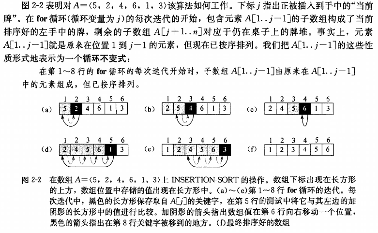
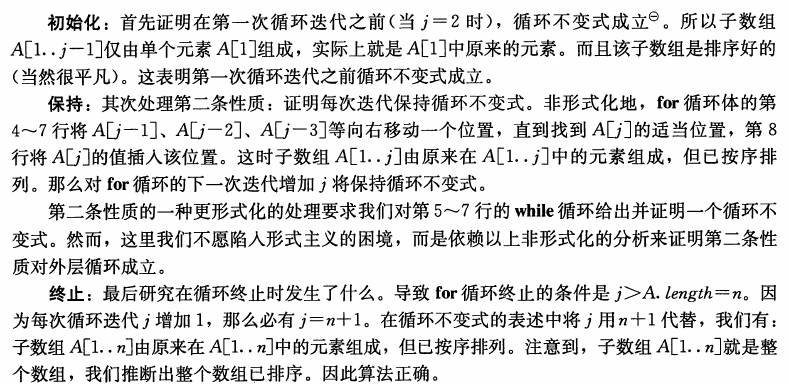
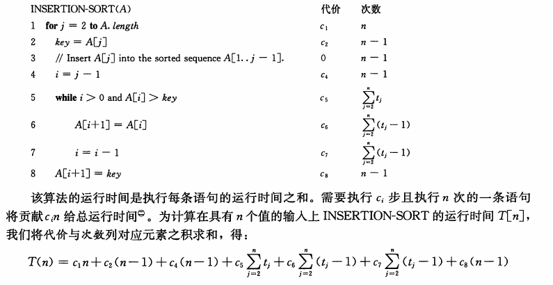
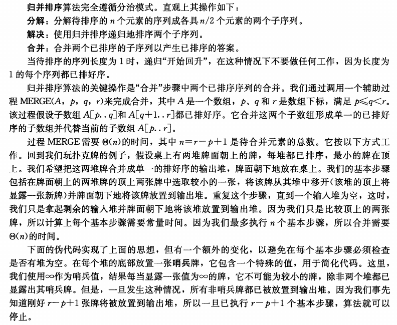

# 算法基础

**排序问题**：

**输入**：n 个数的一个序列 $<a_1, a_2, \dots, a_n>$。

**输出**：输入序列的一个排列 $<a_1', a_2', \dots, a_n'>$，满足 $a_1'\leq a_2'\leq \dots \leq a_n'$。

我们期望排序的数字也成为 **关键字**。

首先介绍 **插入排序**，对于少量元素的排序，它是一个有效的算法。插入排序的工作方式像许多人排序一手扑克牌。开始时，我们的左手为空并且桌子上的牌面向下。然后，我们每次从桌子上拿走一张牌并将它插入左手中正确的位置。为了找到一张牌的正确位置，我们从右到左将它与已在手中的每张牌进行比较。

```
INSERTION-SORT( A )
1   for j = 2 to A.length
2       key = A[j]
3       // Insert A[j] into the sorted sequence A[1...j-1].
4       i = j - 1
5       while i > 0 and A[i] > key
6           A[i+1] = A[i]
7           i = i - 1
8       A[i+1] = key
```

## 循环不变式



循环不变式主要用来帮助我们理解算法的正确性。关于循环不变式，我们必须证明三条性质:

- **初始化**：循环的第一次迭代之前,它为真。
- **保持**：如果循环的某次迭代之前它为真,那么下次迭代之前它仍为真。
- **终止**：在循环终止时,不变式为我们提供一个有用的性质,该性质有助于证明算法是正确的。

当前两条性质成立时，在循环的每次迭代之前循环不变式为真。

当然，为了证明循环不变式在每次迭代之前保持为真，我们完全可以使用不同于循环不变式本身的其他已证实的事实。

第三条性质也许是最重要的，因为我们将使用循环不变式来证明正确性。通常，我们和导致循环终止的条件一起使用循环不变式。终止性不同于我们通常使用数学归纳法的做法，在归纳法中，归纳步是无限地使用的，这里当循环终止时，停止“归纳”。

### 插入排序的循环不变式



注释一：当循环是 **`for`** 循环时，在第一次迭代开始之前，我们将检查循环不变式的时刻是在对循环计数变掀的初始赋值后、在循环头的第一次测试之前。对 `INSERTION-SORT`，这个时刻就是把2赋给变量 $j$ 之后但在第一次测试 $j \leq A.length$ 是否成立之前。

## 伪代码的一些约定

- 缩进表示块结构。该缩进风格也适用于 **`if-else`** 语句，我们缩进 **`else`** 到其匹配的 **`if`** 相同的层次。
- **`while`** 、 **`for`** 与 **`repeat-until`** 等循环结构，以及 **`if-else`** 等条件结构与C、C++等高级语言中的结构具有类似的解释。
- 约定在循环退出的时候，循环计数器保持其值。加法计数器用关键字 **`to`** 表示范围，减法计数器用关键字 **`downto`** 表示范围。循环计数器默认变化为1，当以大于1的一个量改变的时候，该变量跟在可选关键词 **`by`** 之后。
- 符号 `//` 表示该行后面部分是一个注释。
- 形如 `i = j = e` 的多重赋值将表达式将表达式 `e` 的值赋给变量 `i` 和 `j`；它应该被理解为先 `j = e` 然后 `i = j`。
- 变量（如 `i`、`j` 和 `key`）是局部于给定过程的。如果没有显式说明，不使用全局变量。可以看出循环计数器属于循环内外都可以使用。
- 数字元素通过 `数组名[下标]` 这样形式访问。下标从1开始，用 `1...j` 表示第1个元素到第j个元素。
- 复合数据通常被组织成 **对象**，对象又由 **属性** 组成。用 `.` 访问对象的属性，可以使用链式语法。如：`y.x.f` 访问属性。
- 传递参数都是 **按值传递** 给过程：被调用的过程接收其参数自身的副本。如果它对某个参数赋值，调用过程看不到这种变化。当对象被传递时候，指向表示对象数据的指针被复制，而对象的属性却未被赋值。指针和对象一样，传递指针。所以 **对象** 和 **指针** 的变化对调用过程是 **可见的**。
- 一个 **`return`** 语句立即将控制返回到调用过程的调用点。伪代码允许在单一 **`return`** 语句中返回多个值。
- 布尔运算符 `and` 和 `or` 都是 **短路的**。也即如果有 `A and B`，如果 `A` 为 `false`，那么就不会求 `B`。同理，如果有 `A or B`，如果 `A` 为 `ture`，那么也不会求 `B`。
- 关键词 **`error`** 表示因为已被调用的过程情况不对而出现了一个错误。调用过程负责处理该错误，所以我们不用说明将采取什么行动。

## 分析算法

分析算法的结果意味着预测算法需要的资源。

我们假定一种通用的单处理器计算模型——**随机访问机**（random-access machine，RAM）来作为我们的实现技术，算法可以用计算机程序来实现。在 `RAM` 模型中，指令一条接一条地执行，没有并发操作。

事实上，`RAM` 应该精确设计。这里认为，真实计算机是如何设计的，`RAM` 就该如何设计。

`RAM` 模型包含真实计算机中常见的指令：算术指令（如加法、减法、乘法、除法、取余、
向下取整、向上取整）、数据移动指令（装入、存储、复制）和控制指令（条件与无条件转移、子程序调用与返回）。每条这样的指令所需时间都为常量。

但是在个人考虑的时候，还是需要将指令的常数时间需求纳入考虑。比如除法消耗的时间远远大于加法等。

`RAM` 模型中的数据类型有整数型和浮点实数型，但是这里的算法并不着重关心浮点数精度问题。不过在一些应用中，精度是至关重要的。只要将误差控制在可以接受的范围内，一些算法依然是可以运用的。

`RAM` 模型中，在这里并不具有目的性的对某种内存模型进行建模。也就是说，大部分问题不会对高速缓存和虚拟内存进行建模。

### 对插入排序算法的分析

首先，可以预见的是 `INSERTION-SORT` 的运行时间依赖于输入的规模。很多的算法，其运行时间与输入的规模同步增长，所以通常把一个程序的运行时间描述成其输入规模的函数。

为此，定义如下术语：

**输入规模** 的最佳概念依赖于研究的问题。

对于许多的问题，比如排序或者计算离散傅里叶变换，最自然的度量便是 _输入中的项数_，例如等待排序的数组的规模 `n`。如对于两个整数相乘，输入规模的最佳度量是用通常的二进制记号表示输入所需的总位数。而有些时候，输入规模也可能被多个参数控制，如图相关的一些算法。

一个算法在特定输入上的 **运行时间** 是指执行的基本操作数或者步数。

定义 `步` 的概念以便尽量独立于机器是方便的。在简化讨论的情况下，我们认为执行每行伪代码需要常量的时间。即便常量所对应的值可能会不一样。不过，对于包含过程的伪代码行，运行时间显然不是常数，是需要额外计算的。也就是说，我们区分调用子程序的过程（传递参数到该子程序等）与 **执行** 该子程序的过程。



不过对于给定规模的输入，一个算法的运行时间也可能依赖于给定的是该规模下的哪种输入。

比如，一个已经排好序的数组传入插入排序进行排序需要的时间和一个顺序与目的完全相反的数组传入插入排序所需要的时间是不一样的。

可以想象，一个已经排好序的数组传入插入排序进行排序的时候，每个while循环都会在执行一次比较之后退出，所以可以计算其 **最佳情况** 的运行时间为：

$$
\begin{aligned}
T(n)    & = c_1n+c_2(n-1)+c_4(n-1)+c_5(n-1)+c_8(n-1) \\
        & = (c_1+c_2+c_4+c_5+c_8)n-(c_2+c_4+c_5+c_8)
\end{aligned}
$$

我们可以把该运行时间表示为 $an+b$，其中常量 $a$ 和 $b$ 依赖于语句代价 $c_i$。因此，它是 $n$ 的 **线性函数**。

同时对于已经反向排序好的数列，会导致最坏的情况。每一个 **`while`** 循环中，可以有如下成立：

$$for \space all \space j=2,3,\dots,n,\space we \space have$$

$$t_j=j$$

$$\sum_{j=2}^n{t_j}=\frac{n(n+1)}{2}-1$$

$$\sum_{j=2}^n{t_j-1}=\frac{n(n-1)}{2}$$

如此，我们计算出 **最坏情况** 下，`INSERTION-SORT` 的运行时间为：

$$
\begin{aligned}
&T(n)    &=  &c_1n+c_2(n-1)+c_4(n-1)+c_5(\frac{n(n+1)}{2}-1) \\
&        &   &+c_6(\frac{n(n-1)}{2})+c_7(\frac{n(n-1)}{2})+c_8(n-1) \\
&        &=  &(\frac{c_5}{2}+\frac{c_6}{2}+\frac{c_7}{2})n^2+(c_1+c_2+c_4+\frac{c_5}{2}-\frac{c_6}{2}-\frac{c_7}{2}+c_8)n \\
&        &   &-(c_2+c_4+c_5+c_8)
\end{aligned}
$$

我们可以把该最坏情况运行时间表示为 $an^2+bn+c$，其中常量 $a$、$b$ 和 $c$ 又依赖于语句代价 $c_i$。因此，它是 $n$ 的 **二次函数**。

### 最坏情况与平均情况分析

上面，我们考虑了插入排序的最好情况和最坏情况下的运行时间。

我们往往集中于只求 **最坏情况运行时间**，即对规模为 `n` 的任何输入，算法的最长运行时间。下面给出这样做的三点理由:

- 一个算法的最坏情况运行时间给出了任何输入的运行时间的一个上界。知道了这个界，就能确保该算法绝不需要更长的时间。我们不必对运行时间做某种复杂的猜测并可以期望它不会变得更坏。
- 对某些算法，最坏情况经常出现。例如，当在数据库中检索一条特定信息时，若该信息不在数据库中出现，则检索算法的最坏情况会经常出现。在某些应用中，对缺失信息的检索可能是频繁的。
- "平均情况“往往与最坏情况大致一样差。

在某些特定情况下，会对一个算法的平均情况运行时间进行研究。也因此会使用到 **概率分析** 技术。有时可以使用 **随机化算法**，它做出一些随机的选择，以允许进行概率分析并产生某个 **期望** 的运行时间。

接下来，我们做出一种更简化的抽象，即我们真正关心的运行时间的 **增长率** 或 **增长量级**。

所以我们只考虑公式中最重要的项，因为当 `n` 的值很大时，低阶项相对来说不太重要。

我们也忽略最重要的项的常系数，因为对大的输入，在确定计算效率时常量因子不如增长率重要。

例如，对于插入排序的最坏情况运行时间中，我们忽略低阶项和最重要的项的常系数，只剩下最重要的项中的因子 $n^2$。我们记插入排序具有最坏情况运行时间 $\Theta(n^2)$。在给出精确定义前，会形式化的使用该符号。

如果一个算法的最坏情况运行时间具有比另一个算法更低的增长量级，那么我们通常认为前者比后者更有效。由于常量因子和低阶项，对千小的输入，运行时间具有较高增长量级的一个算法与运行时间具有较低增长量级的另一个算法相比，其可能需要较少的时间。但是对足够大的输入，例如，一个 $\Theta(n^2)$ 的算法在最坏情况下比另一个 $\Theta(n^3)$ 的算法要运行得更快。

## 设计算法

插入排序使用了 **增量** 方法。

在排序子数组 `A[1...j-1]` 后，将单个元素 `A[j]` 插入子数组的适当位置，产生排序好的子数组 `A[1...j]`。

### 分治法

许多有用的算法在结构上是递归的：为了解决一个给定的问题，算法一次或多次递归地调用其自身以解决紧密相关的若干子问题。

这些算法典型地遵循分治法的思想：将原问题分解为几个规模较小但类似于原问题的子问题，递归地求解这些子问题，然后再合并这些子问题的解来建立原问题的解。

分治模式在每层递归时都有三个步骤:

- **分解**：原问题为若干子问题，这些子问题是原问题的规模较小的实例。
- **解决**：这些子问题，递归地求解各子问题。然而，若子问题的规模足够小，则直接求解。
- **合并**：这些子问题的解成原问题的解。



```
MERGE( A, p, q, r )
1   n1 = q - p + 1
2   n2 = r - q
3   let L[1..n1+1] and R[1...n2+1] be new arrays
4   for i = 1 to n1
5       L[i] = A[p+i-1]
6   for j = 1 to n2
7       R[j] = A[q+j]
8   L[n1+1] = inf
9   R[n2+1] = inf
10  i = 1
11  j = 1
12  for k = p to r
13      if L[i] <= R[j]
14          A[k] = L[i]
15          i = i + 1
16      else
17          A[k] = R[j]
18          j = j + 1
```


归并排序算法

```
MERGE-SORT( A, p, r )
1   if p < r
2       q = floor((p+r)/2)
3       MERGE-SORT(A, p, q)
4       MERGE-SORT(A, q+1, r)
5       MERGE(A, p, q, r)
```

TODO: 算法分析

## 练习

### 2.1-2

将排序所需要的比较过程从大于修改成小于。

```
INSERTION-SORT( A )
1   for j = 2 to A.length
2       key = A[j]
3       // Insert A[j] into the sorted sequence A[1...j-1].
4       i = j - 1
5       while i > 0 and A[i] < key
6           A[i+1] = A[i]
7           i = i - 1
8       A[i+1] = key
```

### 2.1-3 线性查找 线性搜索

```
LINEAR-SEARCH( A, v )
1   for i = 1 to A.length
2       if a[i] == v
3           return i
4   return NIL
```

**初始化**：实际上因为 `A[1]` 是第一个元素，其左侧没有任何元素，所以左侧是不可能有与 `v` 相等元素的。

**保持**：聚焦这一次的 `A[i]`，因为进入本次循环所以推得上一次的数字，即 `A[i-1]` 不等于 `v`。所以对于 `A[1...i-1]` 均不等于 `v`。那么如果本次 `A[i]` 等于 `v`，即返回 `i` 并退出循环。如果不等于 `v`，那么进入下一次循环前 `A[1...i]` 均不等于 `v`。那么对于 **`for`** 循环，下一次迭代前增加 `i` 将保持循环不变式。

**终止**：当 **`for`** 循环终止的时候，有两种可能，一种是满足 **`if`** 的条件，即当前的 `A[i] == v`，那么返回 `i` 并退出循环。第二种可能是满足了 `i > A.length = n` 的条件。这意味着 `A[1...n]` 均不等于 `v`。那么退出 **`for`** 循环，返回 `NIL`。

### 2.1-4 二进制相加

> **输入**：两个序列 $A=<a_1, a_2, \dots a_n>$ 和 $B=<b_1, b_2, \dots b_n>$。其中 $a_i\space,\space b_i \in \{0, 1\}$。$(i=1, 2, 3 \dots n)$。 
>
> **输出**：一个序列 $C=<c_1, c_2 \dots c_{n+1}>$，为 $A$ 和 $B$ 对应二进制数的和。其中 $c_i \in \{0, 1\}$。$(i=1, 2, 3 \dots n)$。 

两个角度，第一个是考虑加法

```
ADD-BINARY( A, B )
1   c_up = 0
2   for i = 1 to n
3       C[i] = (A[i] + B[i] + c_up) % 2
4       c_up = (A[i] + B[i] + c_up) / 2
5   C[n+1] = c_up
6   return C
```

第二个角度考虑全加器

```
FULL-ADDER( A, B )
1   c_up = 0
2   for i = 1 to n
3       C[i] = A[i] ^ B[i] ^ c_up
4       c_up = A[i] & B[i] | (A[i] ^ B[i]) & c_up
5   C[n+1] = c_up
6   return C
```

我们知道，除法和求模运算的消耗很大，所以可以利用数字均为 `0` 和 `1` 的特性，使用数字电路知识绕过除法和求模。

不过，因为与 `2` 运算，开销不大。

我们可以再改成如下形式：

```
ADD-BINARY-EVIL( A, B )
1   c_up = 0
2   for i = 1 to n
3       C[i] = (A[i] + B[i] + c_up) & 1
4       c_up = (A[i] + B[i] + c_up) >> 1
5   C[n+1] = c_up
6   return C
```

不太推荐哦。

### 2.2-2 选择算法 选择排序

```
SELECTION-SORT( A )
1   for j = 1 to A.length-1
2       min = j
3       for i = j+1 to A.length
4           if A[min] > A[i]
5               min = i
6       exchange A[j] with A[min]
```

循环不变式： `A[1...j-1]` 部分是排好序的。且每个元素均小于 `A[j...n]` 中的元素。

因为按照循环不变式，当完成 `n-1` 次循环后，有 `A[1...n-1]` 中的元素均小于 `A[n]`。所以此时 `A[n]` 是 `n` 个元素中最大的元素，所以此时顺序已经排好。

最好情况和最坏情况都是 $\Theta(n^2)$。

### 2.2-3

平均需要检查输入序列的 $(n+1)/2$ 个元素。

最坏情况需要检查 $n$ 个元素。

运行时间都是 $\Theta(n)$。

平均情况：

$$\sum_{i=1}^n{i \times \frac{1}{n}} = \frac{n+1}{2}$$

最坏情况显然是需要搜索的元素在最后一个，需要检查 $n$ 个元素。

### 2.2-4

在任何算法进行的时候，我们可以对当前的情况进行检查，判断是否已经满足我们所需要的输出的条件。

该检查意味着，任何算法的最好情况运行时间与验证输出满足条件的算法所需要的运行时间有关。


TODO: 检验，以下说法个人还没有证明。

这里我个人认为，验证算法的运行时间是对应求解算法运行时间的下界。

### 2.3-2

```
MERGE( A, p, q, r )
1   n1 = q - p + 1
2   n2 = r - q
3   let L[1..n1] and R[1...n2] be new arrays
4   for i = 1 to n1
5       L[i] = A[p+i-1]
6   for j = 1 to n2
7       R[j] = A[q+j]
8   i = 1
9   j = 1
10  for k = p to r
11      if i > n1
12          A[k] = R[j]
13          j = j + 1
14      else if j > n2
15          A[k] = L[i]
16          i = i + 1
17      else if L[i] <= R[j]
18          A[k] = L[i]
19          i = i + 1
20      else
21          A[k] = R[j]
22          j = j + 1
```

### 2.3-4

$$T(n)=
\left\{
\begin{aligned}
& \Theta(1)      & if\space n=1\\
& T(n-1)+\Theta(n) & if\space n>1
\end{aligned}
\right.$$

### 2.3-5

```
BINARY-SEARCH( A, v )
1   i = 1
2   j = A.length
3   while i <= j
4       if A[i] == v
5           return i
6       if A[j] == v
7           return j
8       mid = floor((i+j)/2)
9       if A[mid] == v
10          return mid
11      else if A[mid] < v
12          i = mid + 1
13      else
14          j = mid - 1
15  return NIL
```

或者

```
BINARY( A, v, l, r )
1   if l > r
2       return NIL
3   if A[l] == v
4       return l
5   if A[r] == v
6       return r
7   mid = floor((l+r)/2)
8   if A[mid] == v
9       return mid
10  else if A[min] < v
11      return BINARY(A, v, mid+1, r)
12  else
13      return BINARY(A, v, l, mid-1)
```

```
BINARY-SEARCH( A, v )
1   return BINARY(A, v, 1, A.length)
```

### 2.3-6

不行，因为查找到以后，我们依然需要将多个元素进行移动，加上这个移动过程所需要的时间，我们依然会到达 $\Theta(n)$。

例如

```
54321 -> 45321 -> 34521 -> 23451 -> 12345

移动次数
0 -> 1 -> 2 -> 3 -> 4
```

同理可以计算出移动次数所需要的时间。

### 2.3-7

可以，甚至可以做到 $\Theta(n)$

$n\lg{n}$ 算法如下：

```
SUM-TO-x( S, x )
for i = 1 to S.length
    if BINARY-SEARCH(S, x-S[i]) != NIL
        return true
return false
```

### 2-1

a.

$$T(n)=\sum_{i=1}^{k-1}{i} \times \frac{n}{k}=\frac{n(k-1)}{2}$$

故而 $\Theta(T(n))=\Theta(nk)$。

b.

$$T(n)=
\left\{
\begin{aligned}
& \Theta(nk)      & if\space n=k\\
& 2T(n/2)+\Theta(n) & if\space n>k
\end{aligned}
\right.
$$

绘制递归树，前 `lg(n/k)` 层使用归并排序，最后一层使用插入排序，每层花费 $\Theta(n)$ 时间合并，所以总共花费 $\Theta(n\lg{(n/k)})$ 时间合并。

c.

我们做不等式

$$
\begin{aligned}
&\Theta(nk+n\lg{\frac{n}{k}}) &\leq &\Theta(n\lg{n}) \\

&\Theta(nk) &\leq &\Theta(n\lg{n}) \\

&\Theta(n\lg{\frac{n}{k}}) &\leq &\Theta(n\lg{n}) \\

&\Rightarrow k \geq 1 \space \land \space k \leq \lg{n}
\end{aligned}
$$

d.

我们将 `k` 作为归并排序中，最短子数组的长度，且保证 `k` 的范围满足 `c.` 的条件，并对这些子数组做插入排序。

### 2-2 冒泡排序

```
BUBBLE-SORT( A )
1   for i = 1 to A.length - 1
2       for j = A.length downto i + 1
3           if A[j] < A[j-1]
4               exchange A[j] with A[j-1]
```

TODO: 循环不变式证明

### 2-3 霍纳规则 Horner's Rule

给定系数 $a_0, a_1, \dots, a_n$ 和 x 的值，代码片段

```
HORNER-RULE( A, x )
1   y = 0
2   for i = n downto 0
3       y = a[i] + x * y
```

实现了用于求值多项式的

$$P(x)=\sum_{k=0}^n{a_kx^k}=a_0+x(a_1+x(a_2+\dots+x(a_{n-1}+xa_n)\dots))$$

的霍纳规则。

a.

运行时间 $\Theta(n)$

b.

```
PLAIN( A, x )
1   y = 1
2   z = 0
3   for i = 0 to n
4       z = a[i] * y
5       y = y * x
```

可能，书中的意思是

```
PLAIN( A, x )
1   z = 0
2   for i = 0 to n
3       y = 1
4       for j = 0 to i
5           y = y * x
6       z = a[i] * y
```

上面的是 $\Theta(n)$，下面一个是 $\Theta(n^2)$。

但是都会有一定的性能差距吧，前者是两个乘法，需要时间比一次加法+一次乘法多一点。而下方按照增长率就能看出完全大于霍纳规则。

可以考虑的是，从上面二者可以看出，后者比前者少了一点“记忆”，后者没能记住前一次计算中出现的重复部分，而是重新计算了一次。前者保存了上一次运行和这一次运行相同的部分，保存了内容。

霍纳规则应该就是保持了“记忆”，所以能够更快一些解决。

TODO: 霍纳规则的正确性

### 2-4 逆序对

TODO: 逆序对

