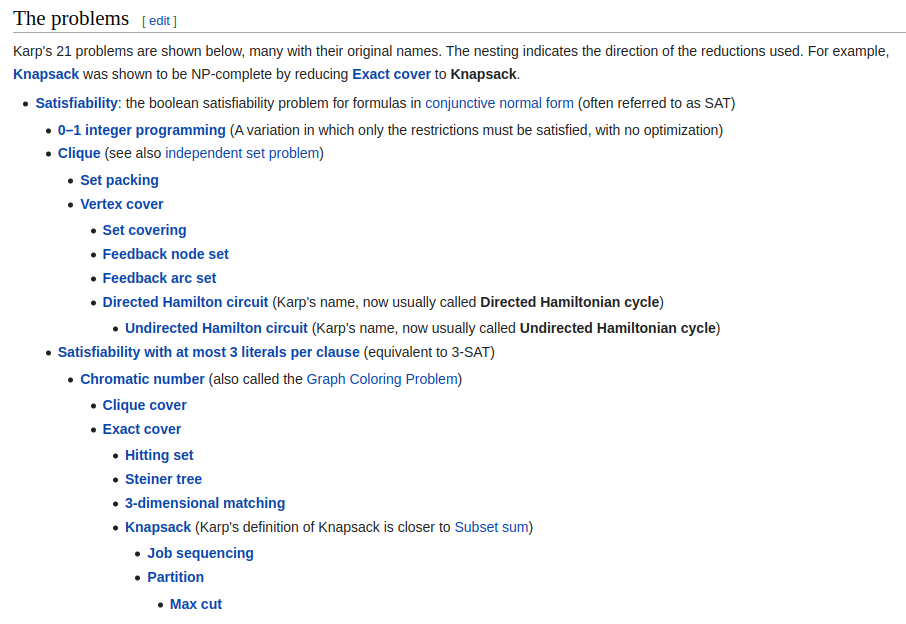

# P和NP问题

参考资料：

- [P versus NP problem - wikipedia](https://en.wikipedia.org/wiki/P_versus_NP_problem)
- [P versus NP problem - britannica](https://britannica.com/science/P-versus-NP-problem)
- [P, NP, NP-Hard & NP-complete problems](https://www.jntua.ac.in/gate-online-classes/registration/downloads/material/a159262902029.pdf)
- [P, NP, NP-Complete and NP-Hard Problems in Computer Science](https://www.baeldung.com/cs/p-np-np-complete-np-hard)

从运行时间上可以把算法分成两类

- 多项式时间算法（Polynomial time algorithm）
    - 用多项式对运行时间限界的算法，即对规模为n的输入，算法在最坏情况下的计算时间是 $O(n^k)$，k是常数。
    - 当n充分大的时候，$1 < \log{n} < n < n\log{n} < n^2 < n^3$。
- 指数时间算法（Exponential time algorithm）
    - 用指数函数对运行时间限界的算法。
    - 当n充分大的时候，$2^n < n! < n^n$。

可以由多项式时间算法解决的问题是“易”处理的问题，需要指数时间才能求解的问题看作是“难”处理的问题。

P（Polynomial）类问题，是确定性图灵机模型上，可在多项式时间内解决的问题类。该问题一定能在多项式时间内验证。

NP（Nondeterministic Polynomial）类问题是非确定性图灵机模型上可以在多项式时间内验证的问题类。

- `P`，可解决，可验证
- `NP-Complete`，NPC，NP完全的，不可解决，可验证，例如哈密顿回路。
- `NP-Hard`，NPH，NP难的，不可解决，不可验证，例如旅行商问题。

---

**归约**

参考资料：

- [Reduction of Hamiltonian Cycle to Traveling Salesman](https://opendsa-server.cs.vt.edu/ODSA/Books/Everything/html/hamiltonianCycle_to_TSP.html)

令A和B是两个判定性问题，如果存在一个确定的算法，可以用多项式时间把问题A的实例I'转换为问题B的实例I，使得I'的答案是yes当且仅当I的答案是yes，则称A以多项式时间归约于B。记作：

$$\mathbf{A} \varpropto p \mathbf{B}$$

一般来说B的困難度不小于A，如果解决了B，那么一定能解决A。

---

令B是一个判定性问题，如果 $B\in NP$ 并且对NP中所有问题 $A\in NP$，都有 $\mathbf{A} \varpropto p \mathbf{B}$，则称问题B是NP完全的。

NP-Hard问题

- 如果对NP中的每一个问题，$A\in NP$，有 $\mathbf{A} \varpropto p \mathbf{B}$，就说B是一个NP-Hard问题。
- B不一定在NP类中。

如果一个判定性问题，是NPC问题的话，那么其对应的最优化问题就是NP-Hard问题。（旅行商问题和对应的最优化问题）

- [Karp's 21 NP-complete problems](https://en.wikipedia.org/wiki/Karp%27s_21_NP-complete_problems)

