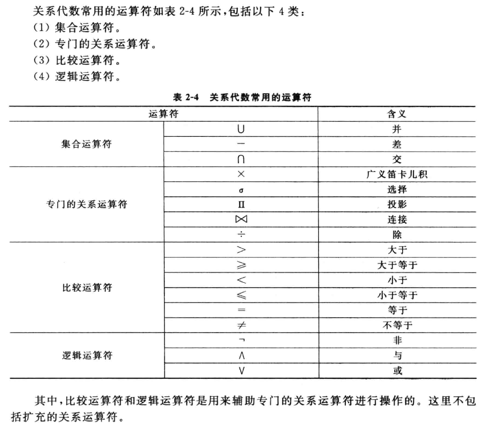

> 《数据库原理与技术》
> 第三版
> 尹为民等编著
> 清华大学出版社

# 数据库系统概论

## 数据库与数据管理

### 数据库基本概念

**数据与信息**

- 数据
  - 数据是描述事物的符号记录；
  - 数据是数据库中存储、用户操纵的基本对象；
  - 数据可以是数值、文字、图形、动画、声音、视频等内容；
  - 数据是信息的符号表示。
- 信息
  - 信息是有一定含义的，经过加工处理的，对决策有价值的数据；
  - 信息是对现实世界中存在的客观实体、现象、联系进行描述的有特定语义的数据；
  - 信息是人类共享的一切知识及客观加工提炼出的各种消息的综合。

信息与数据的关系可以归纳为：

- 数据是信息的载体；
- 信息是数据的内涵；
- 数据是信息的符号表示，而信息通过数据描述，又是数据语义的解释。

**数据库**

数据库（DataBase, DB）是按照一定结构组织，并长期存储于计算机内的、可共享的大量数据的有机集合。

1. 数据库中的数据是按照一定的结构 —— 数据模型来进行组织的；
   1. 数据间有一定的联系；
   2. 数据有语义解释；
   3. 数据与对数据的解释是密不可分的。
2. 数据库的存储介质通常是硬盘，也用磁带、光盘、U盘等，可以大量地、长期地存储及高效地使用；
3. 数据库中的数据能为众多用户所共享，能方便地为不同的应用服务；
4. 数据库是一个有机的数据集成体，它由多种应用的数据集成而来，故具有较少的冗余、较高的数据独立性，也即数据与程序间的互不依赖性；
5. 数据库由 **用户数据** 和 **系统数据库**（即 **数据词典**）两大部分组成。数据词典是关系于系统数据的数据库，通过它能有效地控制和管理用户数据库。

**数据库管理系统**

数据库管理系统（DataBase Management System, DBMS）是管理和维护数据库的系统软件，是数据库和用户之间的一个接口，其主要作用是在数据库建立、运行和维护时对数据库进行统一的管理控制和提供服务。

1. 从操作系统角度，DBMS 是使用者，它建立在操作系统的基础之上，需要操作系统提供底层服务，如创建进程、读写磁盘文件、CPU 和内存管理等；
2. 从数据库角度，DBMS 是管理者，是数据库系统的核心，是为数据库的建立、使用和维护而配置的系统软件，负责对数据库进行统一的管理和控制。
3. 从用户角度，DBMS 是工具或桥梁，是位于操作系统与用户之间的一层数据管理软件。用户发出的或应用程序中的各种操作数据库的命令，都要通过它来执行。

**数据库系统**

数据库系统（DataBase System, DBS）是实现有组织地、动态地存储大量关联数据、方便多用户访问的计算机软件、硬件和人组成的系统。

在一般计算机系统中引入数据库技术后形成数据库系统，故可以简单地说数据库系统是具有管理数据库功能的计算机系统，其简化表示为：

DBS = 计算机系统（硬件、软件平台、人） + DBMS + DB

数据库系统包含以下内容：

- 数据库
- DBMS
- 软件平台
- 硬件支撑环境
- 相关人员

DBMS 在操作系统（Operation System, OS）的支持下，对数据库进行管理与维护，并提供用户对数据库的操作接口。

**信息系统**

信息系统（Information System, IS）是由计算机硬件、网络和通信设备、计算机软件、信息资源、信息用户等组成的以处理信息流为目的的人机一体化系统。它是以提供信息服务为主要目的数据密集型、人机交互的计算机应用系统，具有对信息进行加工处理、存储和传递，同时具有预测、控制和决策等功能。

信息系统的 5 个基本功能：

1. 输入
2. 存储
3. 处理
4. 输出
5. 控制

一个完整的信息系统应该包括：

- 控制与自动化系统
- 辅助决策系统
- 数据库（含知识库系统）
- 与外界交换信息的接口
- etc

从信息系统的发展和特点来看，可大致分为：

- 数据处理系统
- 管理信息系统
- 决策支持系统
- 虚拟现实系统
- 专家系统 / 智能系统
- etc

无论哪种类型的系统都需要基础数据库及其数据管理的支持，故数据库系统是信息系统的重要基石。

### 数据管理技术的发展

**数据处理** 是指对数据进行收集、管理、加工、传播等一系列工作。

其中，数据管理是研究如何对数据分类、组织、编码、存储、检索和维护的一门技术，其优劣直接影响数据处理的效率，因此它是数据处理的核心。

**人工管理**

人工管理阶段是计算机数据管理的初级阶段。

<!-- TODO: 背景 -->

缺点：

- 数据不能长期保存；
- 数据不能共享，冗余度极大；
- 数据独立性差。

**文件系统管理**

<!-- TODO: 背景 -->

特点：

- 数据可以长期保存；
- 对文件进行统一管理，实现了按名存取，文件系统实现了一定程度的数据共享（文件部分相同则难以共享）；
- 文件的逻辑结构与物理结构分开，数据在存储器上的物理位置、存储方式等的改变不会影响用户程序（即物理独立性好），但一旦数据逻辑结构改变，必须修改文件结构的定义，修改应用程序（即逻辑独立性差）。

缺点：

- 逻辑独立性差；
- 数据冗余度较大；
- 文件应用编程复杂。

**数据库系统管理**

特点：

- 管理非结构化数据、海量数据、知识信息
- 面向物联网、云计算等新应用与服务

**总结**

|3 个阶段|人工管理|文件系统|数据库系统|
|-|-|-|-|
|应用背景|科学计算|科学计算、管理|大规模数据、分布数据的管理|
|硬件背景|无直接存取存储设备|磁带、磁盘、磁鼓|大容量磁盘、可擦写光盘、按需增容磁带机等|
|软件背景|无专门管理软件|利用操作系统的文件系统|由 DBMS 支撑|
|数据处理方式|批处理|联机实时处理、批处理|联机实时处理、批处理、分布处理|
|数据的管理者|用户/程序管理|文件系统代理|由 DBMS 管理|
|数据应用及其扩充|面向某一应用程序、难以扩充|面向某一应用系统、不易扩充|面向多种应用系统、容易扩充|
|数据的共享性|无共享、冗余度极大|共享性较差、冗余度大|共享性好、冗余度小|
|数据的独立性|数据的独立性差|物理独立性好、逻辑独立性差|极有高度的物理独立性、具有较好的逻辑独立性|
|数据的结构化|数据无结构|记录内有结构、整体无结构|统一的数据模型、整体结构化|
数据的安全性|应用程序保护|文件系统提供基本保护|由 DBMS 提供完善的安全保护|

## 数据模型与信息模型

数据库系统是一个基于计算机的、统一集中的数据管理机构。

现实世界错综复杂联系的食物最后能以计算机所能理解和表现的形式反映到数据库中，这是一个逐步转化的过程，通常分为 3 个阶段，称之为 **3 个世界**，即现实世界、信息世界和机器世界（即计算机世界）。

现实世界存在的客观事物及其联系、经过人们大脑的认识、分析和抽象后，用物理符号、图形等表述出来，即得到信息世界的信息，再将信息世界的信息进一步具体描述、规范、并转换为计算机所能接受的形式、则成为机器世界的数据表示。

### 3 个世界及其联系

**1. 现实世界**

现实世界就是客观存在的世界，它是由事物及其互相之间的联系组成。

在现实世界中，人们通常选用感兴趣的以及最能表示事物本质的若干特性来描述事物，同时事物之间的联系也是丰富多彩的。要想让现实世界在计算机的数据库中得以展现，重要的就是将那些最有用的事物特征及其相互间的联系提取出来。

**2. 信息世界**

现实世界中的事物及其联系由人们的感官感知，经过人们头脑分析、归纳、抽象形成信息。对这些信息进行记录、整理、归类和形式化后，形成一些基本概念及联系，他们构成了信息世界。

信息世界是一种相对抽象与概念化的世界，它介于现实世界与计算机世界之间，起着承上启下的作用。

信息世界的基本概念：

1. 实体；
   1. 将现实世界中客观存在的，并能够相互区分的事物经过加工，抽象成为信息世界的实体；
   2. 实体是信息世界的基本单位，它可指事物，也可以指事物之间的联系；
   3. 它可以是具体的，也可以是抽象的；
   4. 信息模型是反映实体集以及实体集之间联系的一个抽象模型。
2. 属性；
   1. 属性指实体所具有的某方面的特性；
   2. 现实世界中的事物都具有一些特征，这些特征在信息世界中通过与其对应的实体反映出来。人们抽取出实体的有用特征后，用属性名来表示；
   3. 一个实体可以由若干个属性来描述；
   4. 属性类型通常分为以下几种：
      1. 简单属性和复合属性；
         1. 简单属性也成为原子属性，就是不可再分割属性；
         2. 复合属性可以被分解为更为简单、更基本的属性；
         3. 若复合属性只作为整体进行引用，则不必将其划分为子属性，而直接作为属性；
         4. 复合属性的值是由组成它的简单属性的值所构成的。
      2. 单值属性和多值属性；
         1. 通常，一个实体的某个具体属性只有一个值，这样的属性称为单值属性；
         2. 有些属性可能有多个值，这样的属性称为多值属性。
      3. 存储属性和派生属性。
         1. 存储属性和派生属性也称为基本属性和导出属性。
3. 属性域；
   1. 属性域指属性的取值范围；
   2. 每种属性都有值，而且具有一定的取值范围，此范围称为属性域。
4. 实体键；
   1. 实体键又称为实体码；
   2. 实体键是能唯一标识每一个实体的最小属性集。
   3. 每个实体集一定有实体键。
5. 实体型；
   1. 实体型是对某一数据的结构和特征的描述；
   2. 实体型用实体名及其属性名集合来抽象和刻画同类实体；
   3. 实体值是实体的具体内容，是由描述某实体型的各属性值构成。
6. 实体集。
   1. 实体集是指同类型实体的集合。

**3. 机器世界**

用计算机管理信息，必须对信息进行数据化，数据化后的信息称为机器世界的数据，数据是能够被计算机识别、存储并处理的。

在机器世界采用记录、数据项来描述信息世界的实体及属性。

数据模型是一种表示数据及其联系的模型，是对现实世界数据特征与联系的反映与刻画。

**4. 两类模型**

在数据库技术中，根据模型应用的不同目的，划分为两类，即信息模型（也称概念模型）和数据模型（也称数据库模型）。

在信息世界里，对所研究的信息建立一个抽象的模型，以反映实体集及实体集之间的联系，人们称之为信息模型。它是从用户的观点来对数据建模，主要用于数据库设计。

在机器世界则采用数据模型来具体描述、进一步刻画信息模型，它是从计算机系统的观点来对数据建模，主要用于 BDMS 的实现。

在不同环境中解释同一个客观对象时候，以不同的方式进行描述，即描述同一个客观对象在信息世界用信息模型，在机器世界用数据模型。

### 信息模型的表示

信息模型是现实世界到机器世界的一个中间层次。

现实世界的事物反映到人的大脑中，人们把这些事物首先抽象为一种既不依赖于具体的计算机系统又不受某一 DBMS 所左右的信息模型，然后在把信息模型转换为计算机上某一 DBMS 所支持的数据模型。

**1. 实体集之间的联系**

实体集间的联系包括两种：

- 实体集之间的联系；
  - 实体集之间的联系是指不同实体集之间的联系。
- 实体集内部的联系。
  - 实体集内部的联系是指实体集的各属性之间的相互联系。

两个实体集间的联系分为以下 3 类：

1. 一对一联系（1：1）；
   1. 对于实体集 X 中的每一个实体，实体集 Y 中有 0 个或者 1 个实体与之联系，反之亦然。则称实体集 X 与实体集 Y 具有一对一的联系；
2. 一对多联系（1：n）；
   1. 对于实体集 X 中的每一个实体，实体集 Y 中有 0 个或者多个实体与之联系；反之，对于实体集 Y 中的每一个实体，实体集 X 中有 0 个或者 1 个实体与之对应。则称实体集 X 与实体集 Y 具有一对多的联系；
3. 多对多联系（m：n）。
   1. 对于实体集 X 中的每一个实体，实体集 Y 中有 0 个或者多个实体与之联系；反之，对于实体集 Y 中的每一个实体，实体集 X 中有 0 个或者多个个实体与之对应。则称实体集 X 与实体集 Y 具有多对多的联系。

**2. 信息模型的表示方法**

信息模型最常用的表示方法：实体 - 联系（Entity - Relationship）方法。简称 E-R 法。该方法用 E-R 图来描述现实世界的信息模型，故又称实体联系模型。

- E-R 图提供了表示实体集、属性和联系的方法；
- E-R 图中，事物用实体集表示，事物的特征用属性表示，事物之间的关联用联系表示；
- 实体联系模型是数据库设计的有效工具。

E-R 图的基本成分：

1. 实体集。用矩形表示，矩形框内标注实体集名（一般用名词）；
2. 属性。用椭圆形表示，椭圆形框内标注属性名（一般用名词），并用无向边将其与相应的实体连接起来；
3. 联系。用菱形表示，菱形框内标注联系名（一般用动词），并用无向边分别与有关实体集连接起来，同时在无向边旁标注上联系类型（1：1、1：n、或m：n）。

实体集间的联系：

- 两实体集间的联系
- 多实体集间的联系
- 同一实体集内的联系

### 数据模型的组成

数据模型是描述数据特征及数据之间联系的模型。它是在信息模型的基础上建立的一个适合于计算机表示的数据层的模型，是对信息模型进一步数据描述得到的模型。

**1. 数据模型的三要素**

一个数据模型应当描述数据对象的 3 个要素，即数据结构、数据操作和数据的完整性约束。

1. 数据结构
   1. 数据结构是指数据对象类型的集合；
   2. 数据结构描述数据对象的数据类型、性质及数据之间的联系；
   3. 数据结构是对数据库静态特性的描述；
   4. 解释如下：
      1. 数据结构是描述数据模型最重要的方面，通常按数据结构的类型来命名数据模型。例如：层次结构即树结构的数据模型叫层次模型，网状结构即图结构的数据模型叫网状模型，关系结构即表结构的数据模型叫关系模型；
      2. 数据对象类型的集合包括与数据类型、性质及数据之间联系有关的对象，如关系模型中的域、属性、关系、各种键等；
      3. 表示数据之间的联系有隐式和显式两类。
         1. 隐式是指通过数据本身关联过相对位置顺序表明联系；
         2. 显式联系是指通过附加指针表明联系或直接表示。
2. 数据操作
   1. 数据操作是指允许对数据库中数据值进行操作的集合，包括操作语言及其有关操作规则，在数据模型中需要对其详细定义。
   2. 数据操作是对数据库动态特性的描述。
   3. 解释如下：
      1. 数据库主要有查询和更新（包括插入、删除、修改）两大类基本操作。
      2. 数据库模型必须定义这些操作的确切含义、操作符号、操作规则（比如优先级）以及实现操作的语言。
3. 数据的完整性约束
   1. 数据的完整性约束是一组数据完整性规则的集合。
   2. 数据的完整性约束是对数据以及数据之间关系的制约和依存规则。

**2. 数据模型的分类**

1. 3 种基本数据模型
   1. 基本数据模型指层次模型、网状模型和关系模型；
   2. 层次模型将数据库的数据按树结构的形式进行组织；
   3. 网状模型将数据库的数据按图结构的形式进行组织；
   4. 关系模型将数据库的数据按表结构的形式进行组织，关系数据模型是当今数据库中最主要的基本模型；
   5. 3 种基本数据模型都以数据项组成的数据记录作为数据结构的基本单元。
2. 面向对象数据模型
   1. 面向对象数据模型以对象类及其类层次为基本的数据结构，采用了面向对象方法中的对象、方法、消息、属性、继承等概念，对现实世界的抽象更为自然和直接；
   2. 面向对象模型能描述复杂世界，具有较强的灵活性、可扩充性与可重用性。
3. 谓词模型（逻辑模型）
   1. 谓词模型是一种基于逻辑的数据模型；
   2. 谓词模型用一阶谓词及谓词公式表示实体集、属性、联系与完整性约束等，以建立数据的抽象模型；
   3. 谓词模型的表现力强、形式简单，是演绎数据库及知识数据库的基础模型。
4. XML 数据模型
   1. XML（eXtensible Markup Language），可拓展标记语言是互联网上数据表示和交换的标准。网页数据是一种特殊的半结构化数据；
   2. XML 数据模型本身是树状模型，一个格式良好且有效的 XML 文档经过解析后，就会在内存中建立一棵树。因此，对于现实世界中数据具有次序语序和层次结构，该数据模型能够方便地表示和便于动态维护；
   3. XML 的层次使得其很容易以自然的格式捕捉不同数据之间的关系。
5. 非 SQL（Structured Query Language，结构化查询语言）数据模型
   1. 数据结构简单、多样，适用于数据高并发读写和海量数据的存储，是新型数据库采用的数据模型，包括键值模型、列式模型、文档模型、图形模型；
   2. 非 SQL 数据模型适用于不同的领域，需要根据实际应用的场景进行选择，对于大型复杂应用常使用多种不同的模型，从而有效处理各种不同类型的负载。
6. 扩充的数据模型
   1. 扩充的数据模型是在基本数据模型的基础上进行扩充、综合多种模型的特点所得到的模型；
   2. 扩充的数据模型扬长避短，具有多种模型的优势，比如：对象关系模型、数据联合模型、云数据库模型等。

根据数据库的发展，按数据模型来划分，数据库可分为：

1. 层次数据库
2. 网状数据库
3. 关系数据库
4. 面向对象数据库
5. 对象关系数据库
6. 演绎数据库
7. XML 数据库
8. 云数据库
9. 智能数据库
10. etc

### 基本数据模型

**1. 层次模型**

层次模型是数据库系统最早出现的数据模型。

层次模型用树形结构表示各类实体集以及实体集之间的联系。

1. 层次模型的数据结构
   1. 层次模型是用树形结构来表示各类实体集以及实体集间的联系；
   2. 层次模型对父子实体集间具有一对多的层次关系的描述非常自然、直观、容易理解；
   3. 层次模型的两个较为突出的问题。
      1. 层次模型中具有一定的存取路径，需按路径查看给定记录的值；
      2. 层次模型比较适合于表示数据记录类型之间的一对多联系，而对于多对多的联系则难以直接表示，需进行转换，将其分解成若干个一对多联系。
2. 层次模型的数据操作
   1. 数据库的基本操作包括数据记录的查询、插入、删除和修改等操作；
   2. 层次模型的物理数据常用两种方法存储：
      1. 按照先根次序顺序存储；
      2. 用左孩子右兄弟链式存储。
   3. 层次模型支持按层次顺序查询和按层次路径查询操作；
   4. 对层次模型数据库中的数据进行查询操作时，操作者必须熟悉数据的层次结构，而且每次操作只能取一个记录，若要取多个记录，必须使用循环语句；
   5. 层次模型对应的系统提供给用户的数据库语言为过程化的语言，数据独立性较差。
3. 层次模型的数据完整性约束
   1. 层次数据的结构特性使得对于层次模型数据库进行插入、删除、修改操作时必须遵守父子约束、一致性约束、数据的型和值保持树型结构等
   2. 层次模型的数据结构组织，使得它适应变化的能力非常差。
   3. 在层次模型中，不能改变原数据库结构中所定义的记录型间的父子关系，否则就要对整个数据库进行重新组织，这无疑大大增加了系统的开销，且难以适应许多动态变化的应用环境。
4. 层次模型的主要优、缺点：
   1. 数据结构较简单；查询效率高；
   2. 提供良好的完整性支持；
   3. 不易表示多对多的联系；
   4. 数据操作限制多、独立性较差。

**2. 网状模型**

网状模型用于方便描述现实世界中，具有非层次特点的事物及其联系。这是层次模型难以表示的。

网状模型是一个图结构，它是由字段（属性）、记录类型（实体型）和系（set）等对象组成的网状结构的模型。从图论的角度来看，它是一个不加任何条件的有向图。

1. 网状模型的数据结构
   1. 网状模型是用图结构来表示各类实体集以及实体集间的联系；
   2. 网状结构和层次结构的根本区别是：
      1. 一个子结点可以有多个父结点；
      2. 在两个结点之间可以有多种联系。
   3. 网状模型对于多对多的联系难以直接表示，需进行转换，将其分解成若干个一对多联系。
2. 网状模型的数据操作
   1. 包括查询、插入、删除和修改等操作，使用的是过程化语言；
   2. 网状模型数据库的存储常用链接法；
   3. 由于实体集间的联系本质上通过存取路径指示，因此网状数据库是导航式数据库，用户在对数据库进行操作时，必须说明做什么、如何做。
3. 网状模型的数据完整性约束
   1. 父子约束
   2. 主从约束
4. 网状模型的优缺点
   1. 较为直接地描述现实世界；
   2. 存取效率较高；
   3. 结构较复杂、不易使用；
   4. 数据独立性较差。

**3. 关系模型**

一个关系模型的数据结构是若干个二维表结构，它表示不同的实体集及实体集之间的联系。

在关系模型中，把二维表称为关系，二维表由行和列组成。每一行称为一个元组，每列称为一个属性。

与网状模型和层次模型不同，关系模型中，实体集之间的联系是通过表格自然表示的。此外，表之间还有型和值的隐式联系（用于完整性约束和关联查询），均不需人为设置指针。

由于数据本身和数据之间的联系均是通过表结构描述，故物理存储时，数据只需以文件的形式存储即可。关系模型的数据操作主要包括查询和更新数据。这些操作必须满足关系的完整性约束。

由于表结构是一种线性结构，且存取路径对用户透明，故查询效率往往不如非关系数据模型。此外，它在执行查询操作时，还需要执行一系列的拆分表、连接、合并表等操作，故相对耗时。因此，为了提高性能，系统必须对用户的查询请求进行优化，这增加了 DBMS 的负担。

关系模型的主要优缺点：

1. 有坚实的理论基础；
2. 结构简单、易用；
3. 数据独立性及安全性好；
4. 查询效率较低。

**总结**

|模型\特点|数据结构|联系表示的特点|联系方式|使用与效率|数据操作语言|理论基础|
|-|-|-|-|-|-|-|
|层次模型|树结构|适用于1：n层次联系|通过指针（或路径）|较难使用、效率较高|过程化|无|
|网状模型|图结构|可间接表示m：n联系|通过指针（或路径）|使用复杂、效率较高|过程花|无|
|关系模型|表结构|便于表示m：n联系|自然联系及创建联系|使用容易、效率较低|非过程化及过程拓展|关系理论|

> 说明：统一客观事物可以用不同的数据模型描述。层次、网状和关系 3 种数据模型描述可以相互转换。现在，采用先进查询优化技术的现代关系数据库系统的操作效率，已经超过了传统的建立在层次模型、网状模型上的数据库系统。

## 数据库系统结构

### 3 级模式结构

从数据库管理系统角度来看，数据库系统内部的体系结构通常采用 3 级模式结构：

- 子模式 - 用户级
- 模式 - 概念级
- 内模式 - 物理级

**1. 模式（Schema）**

模式（也称概念模式或逻辑模式）是数据库中全体数据的逻辑结构和特征的描述，是所有用户的公用数据库结构。它描述了现实世界中的实体及其性质与联系，具体定义了记录型、数据项、访问控制、保密定义、完整性（正确性与可靠性）约束以及记录型之间的各种联系。

解释如下：

1. 一个数据库只有一个模式；
2. 模式与具体应用程序无关，它只是装配数据的一个框架；
3. 模式用语言描述和定义，需定义数据和逻辑结构、数据有关的安全性等。

**2. 子模式（External Schema）**

子模式（也称外模式或用户模式）是数据库用户所见和使用的局部数据的逻辑结构和特征的描述，是用户所使用的数据库结构。子模式是模式的子集，它主要描述用户用户视图的各记录的组成、相互联系、数据项的特征等。

解释如下：

1. 一个数据库可以有多个子模式；每个用户至少使用一个子模式；
2. 同一个用户可使用不同的子模式，而子模式可为多个不同用户所用；
3. 模式是对全体用户数据及其关系的综合与抽象，子模式是根据所需对模式的抽取。

**3. 内模式（Internal Schema）**

内模式（也称存储模式）是数据物理结构和存储方法的描述。它是整个数据库的最低层结构表示。

内模式中定义的是存储记录的类型，存储域的表示，存储记录的物理顺序、索引和存取路径等数据的存储组织，如存储方式按哈希方法存储，索引按顺序方式组织，数据以压缩、加密方式存储等。

解释如下：

1. 一个数据库只有一个内模式。内模式对用户透明；
2. 一个数据库由多种文件组成，如用户数据文件、索引文件及系统文件等；
3. 内模式设计直接影响数据库的性能。

**4. 数据独立性与二级映射功能**

数据独立性是指数据与程序间的互不依赖性。一般分为物理独立性和逻辑独立性。

- 物理独立性
  - 物理独立性是指数据库物理结构的改变不影响逻辑结构及应用程序。
  - 数据的物理独立性指：数据的存储结构的改变，比如存储设备的更换、存储数据的位移、存取方式的改变等不影响数据库的逻辑结构，从而不会引起应用程序的变化。
- 逻辑独立性
  - 逻辑独立性是指数据库逻辑结构的改变不影响应用程序。
  - 数据的逻辑独立性指：数据库总体逻辑结构的改变，如修改数据结构定义、增加新的数据类型、改变数据间联系等，不需要相应修改应用程序。

为了实现数据独立性，数据库系统在 3 级模式之间提供了两极映像。

1. 映像 1。子模式 / 模式 映像是指由模式生成子模式的规则。它定义了各个子模式和模式之间的对应关系。
2. 映像 2。模式 / 内模式 映像是说明模式在物理设备中的存储结构。它定义了模式和内模式之间的对应关系。

> **注意**：
> 1. 模式 / 内模式映像是唯一的。当数据库的存储结构改变时，如采用了更先进的存储结构，由数据库管理员对模式 / 内模式映像作相应改变，可以使模式保持不便，从而保证了数据的物理独立性。
> 2. 子模式 / 模式映像不唯一。当模式改变时，如增加新的数据项、数据项改名等，由数据库管理员对各个子模式 / 模式的映像作相应改变，可以使子模式保持不变，从而保证了数据的逻辑独立性。

正是 3 级模式结构和它们之间的两层映像，保证了数据库系统的数据能够具有较高的逻辑独立性和物理独立性。

有效地实现三级模式之间转换的是 DBMS 的职能。

> **说明**：
> 模式与数据库的概念是有区别的。模式是数据库结构的定义和描述，只是建立一个数据库的框架，它本身不涉及具体的数据；数据库是按照模式的框架装入数据而建成的，它是模式的一个“实例”。数据库中的数据是经常变化的，而模式一般是不变或很少变化的。

### 数据库系统体系结构

**1. 单用户式结构**

- 单用户式数据库系统运行在单台计算机上；
- 整个数据库系统，包括应用程序、DBMS、数据，都装在一台计算机上；
- 某时间段数据库系统仅为一个用户所独占，且不同机器之间不能直接共享。

**2. 主从式结构**

- 主从式结构的数据库系统指一个主机带多个终端的多用户数据库系统；
- 主从式结构中，数据库系统，包括应用程序、DBMS、数据，都集中存放在主机上，所有处理任务都由主机来完成，各个用户通过主机的终端并发地存取、使用数据库，共享数据资源；
- 主从式数据库系统中的主机是一个通用计算机，既执行 DBMS 功能又执行应用程序。

主从式结构数据库系统优缺点：

- 易于管理与维护；
- 主机的任务可能过于繁重，成为瓶颈，从而使系统性能大幅下降；
- 当主机出现故障时，整个系统瘫痪，因此系统的可靠性不高。

**3. 客户 / 服务器结构**

随着工作站功能的增强和广泛使用，人们开始把 DBMS 功能和应用分开，网络中某些节点上的计算机专门用于存放数据库和执行 DBMS 功能，称为数据库服务器，简称服务器；其他节点上的计算机安装 DBMS 的外围应用开发工具，支持用户的交互与应用，称为客户机，这就是客户 / 服务器结构的数据库系统。

在客户 / 服务器结构中，客户端的用户请求被传送到数据库服务器，数据库服务器进行处理后，只将结果数据返回给用户。

客户 / 服务器结构数据库的优缺点：

- 显著提高了系统性能、吞吐量和负载能力；
- 客户 / 服务器结构数据库往往更加开放，有多种不同的硬件和软件平台及更灵活的数据库应用开发工具；
- 应用程序具有更强的可移植性；
- 可以减少软件维护的开销；
- 对服务器主机的性能有较高的要求；
- 远程应用依赖于网络通信效率。

**4. 分布式结构**

分布式结构的数据库系统指数据库中的数据在逻辑上是一个整体，但物理地分布在计算机网络的不同节点上。网络中的每一个节点都可以独立处理本地数据库中的数据，执行局部应用；同时也可以存取和处理多个异地数据库中的数据，执行全局应用。

分布式结构的数据库系统是计算机网络发展的必然产物，它适应了地理上分散的公司、团体和组织对于数据库应用、远程共享的需求。

分布式结构的数据库是以网络为平台的数据库系统，数据分布对用户是透明的，用户面对的仍是一个逻辑上完整的数据库。

分布式结构数据库的优缺点：

- 能充分分享、高效地使用远程资源，各节点又能独立自洽；
- 数据分布存放给数据的处理、管理与维护带来了困难；
- 当用户需要经常访问多处远程数据时，系统效率会明显地受到网络交通的制约。

**5. 并行结构**

并行结构的数据库系统是在并行机上运行的具有并行处理能力的数据库系统。它用高速网络连接各个数据处理节点，整个网络中的所有节点构成逻辑上统一的整体，用户可以对各个节点上的数据进行透明存取。其建立在并行计算机系统上，采用多 CPU 和多硬盘的并行工作方式，极大地提高了系统的处理速度和 I/O 速度。

并行数据库系统将数据库技术与并行技术相结合，发挥多处理机结构的优势，采用先进的并行查询技术和并行数据管理技术，实行任务分布，利用各个节点协同作用，并行地完成数据库任务，提高数据库的整体性能。

它的目标是提供一个高性能、高可用性、高可拓展性的 DBMS，而在性能价格比方面，较相应大型机上的 DBMS 高得多。

其缺点是实现技术较复杂。

### 数据库系统的组成

数据库系统由三大部分组成，即：

- 硬件平台
- 软件平台
  - 操作系统
  - DBMS
  - 数据库
  - 语言工具与开发环境
  - 数据库应用软件
  - etc
- 相关人员

这三大部分构成了一个以 DBMS 为核心的完整的运行实体，称之为数据库系统。

**1. 硬件平台**

数据库系统中的硬件平台包括以下两类：

1. 计算机设备。它是系统中硬件的基础平台，如微型机、小型机、中型机、大型机及特殊工作站。
2. 网络及其通信设备。

在数据库系统中应有存放数据文件的大容量存储器，还需要相应的输入输出（I/O）设备、中央处理机等，它们构成了数据库系统运行的基础硬件。

在数据处理中，数据处理的速度除了与计算机本身的运算速度有关外，主要的就是 I/O 所占的时间。在为数据库系统选取硬件设备时，要着重考虑 CPU、I/O 的速度和存储容量。对于网上运行的数据库系统，还需要考虑其传输效率。

一个数据库系统的硬件环境有多种实现方式：

- 一台微机上的独立的数据库系统；
- 多台计算机通过网络互联，共享服务器上数据的网络数据库系统；
- 利用传感器、无线数据通信技术，通过互联网实现物品的自动识别、互联与信息共享的物联网数据库系统；
- 连接云数据库的虚拟系统。

**2. 软件系统**

1. DBMS
   1. DBMS 是为建立、使用和维护数据库而配置的系统软件，由数据库软件制造商提供；
   2. 部分 DBMS 仅提供数据库管理功能，故还需要利用其他开发工具开发基于数据库的信息系统；
   3. 目前，多数高端 DBMS 自带可视化集成开发环境或商业智能开发平台。
2. 操作系统
   1. 操作系统是整个数据库系统的重要软件平台，提供基础功能与支撑环境。
   2. 目前常用的有 Windows、UNIX、Linux 与 OS2 等。
3. 语言工具与开发环境
   1. 开发数据库应用系统所使用的语言、工具及集成开发环境。
   2. 包括
      1. 高级程序设计语言
      2. 可视化开发工具
      3. 与网络有关的编程环境，如 .NET、XML、C#、各种脚本语言
      4. 专用图形、图像、视频等处理工具
   3. 数据库与应用、数据库与网络之间还存在着多种访问接口或中间件，实现异构数据库的互访、互操作。
4. 数据库应用软件
   1. 数据库系统中，应用软件和界面是利用 DBMS 及其相关的开发工具为特定应用而开发的软件。
5. 数据库
   1. 数据库是反映企业或组织当前状态的数据集合。这里当前状态是指企业或组织的经营情况，如当前财务情况、人员构成情况。
   2. 为应用方便，用数据库中主体数据的含义来标识数据库。

**3. 人员**

1. 数据库管理员（DataBase Administrator, DBA）
   1. DBA 是数据库系统中的一个重要角色，主要负责设计、建立、管理和维护数据库，协调各用户对数据库的要求等。
   2. DBA 需要熟悉、掌握程序语言和多种系统软件，充分了解各种用户的需求、各应用部门的业务工作才能控制全局。
   3. 大系统的 DBA 往往是一个工作小组，其主要职责有：
      1. 数据库结构设计；
      2. 数据库维护；
      3. 调整数据库结构；
      4. 扩充系统功能；
      5. 改善数据库系统性能；
      6. etc
2. 系统分析员和数据库设计人员
   1. 系统分析员是数据库系统设计中的高级人员，主要负责数据库系统建设的前期工作，包括应用系统的需求分析、规范说明和数据库系统的总体设计等；
   2. 数据库设计人员参与用户需求调查、应用系统的需求分析后，主要负责数据库的设计，包括各级模式的设计、确定数据库中的数据等。
3. 应用程序员
   1. 应用程序员负责设计、编写数据库应用的程序模块，用以完成对数据库的操作。
   2. 应用程序员使用某些高级语言或利用多种数据库开发工具生成应用程序，组合成系统，并负责调试安装。
4. 用户
   1. 也称终端用户，如公司、银行职员、操作员等
   2. 人们通过用户界面，如浏览器网页、图形表格、功能菜单等使用数据库

**4. 数据库系统的特点**

数据库系统有很多不同于其他系统的特点：

1. 数据集成性好。主要表现在如下几个方面：
   1. 统一的数据模型。这是数据库系统与文件系统的本质区别。
   2. 面向多个应用。数据库是全局的、多个应用共享的有机数据集合。
   3. 局部与全局的独立统一。局部与局部、局部与全局的数据库结构既独立又统一。
2. 数据共享性高。主要表现在如下几个方面：
   1. 充分共享且范围广。
      1. 数据库中的数据的共享可到数据项级；
      2. 数据库组织的规范和标准也有利于数据的网络传输和更大范围、更多应用的共享。
   2. 冗余度低
      1. 冗余度是指同一数据被重复存储的程度；
      2. 数据库系统由于数据整体按结构化构造、规范化组织，并充分精简，使得冗余度可以降到最低；
      3. 冗余度低不仅可以节省存储空间，更重要的是可减少数据的不一致性（即同一数据的不同副本的数据值不一致）。
   3. 易扩充
      1. 由于设计的时候考虑数据充分组织并结构化，面向整个系统，而不是面向某个应用，所以容易扩充；
      2. 应用改变时候，可重选或扩充数据集。
3. 数据独立性强
   1. 一个具有数据独立性的系统可称为面向数据的系统，即数据的逻辑结构、存储结构与存取方式的改变不影响应用程序，而应用的改变也不至于马上引起数据库结构的调整。
   2. 由于应用程序不是直接从数据库中取数，是通过 DBMS 间接存取，而 DBMS 提供了相应的屏蔽功能，故较好的实现了应用程序与数据库数据的相互独立。
4. 数据控制力度大
   1. 数据库中数据由 DBMS 统一管理和控制。
   2. 由于数据库是共享的，即多个用户可以同时存取数据库中的数据，甚至可以共享数据库中同一个数据。为此，DBMS 必须提供强有力的数据安全性保护、并发控制、故障恢复等功能。

### 数据库管理系统

**1. DBMS 的功能**

DBMS 是一种负责数据库的定义、建立、操纵、管理和维护的软件系统，其职能是有效地实现数据库 3 级模式之间的转换。

DBMS 是数据库系统的核心，它建立在操作系统的基础之上，是位于操作系统与用户之间的一层数据管理软件，负责对数据库进行统一的管理和控制。用户发出的或应用程序中的各种操作数据库中数据的命令，都要通过 DBMS 来执行。

DBMS 还承担着数据库的维护及并发操作的协调工作，能够按照数据库管理员所规定的要求，保证数据库的安全性和完整性。

由于不同的 DBMS 要求的硬件资源、软件环境是不同的，因此其功能与性能也存在差异。

一般来说，DBMS 的功能主要包括以下 6 个方面：

1. 数据定义
   1. DBMS 提供了数据定义语言；
   2. 用户可以使用数据定义语言做到：
      1. 定义数据库的子模式、模式、内模式；
      2. 定义各个子模式与模式之间、模式与内模式之间的映射；
      3. 定义保证数据库中数据具有正确语义的完整性规则、保证数据库安全的用户口令和存取权限；
      4. etc
2. 数据操作
   1. DBMS 提供了数据操纵语言；
   2. 用户可以使用数据操纵语言实现：
      1. 查询检索；
      2. 插入；
      3. 修改；
      4. 删除
      5. etc
   3. 高级 DBMS 还提供了复杂数据的操作：
      1. 全文搜索；
      2. 领域搜索；
      3. 多维数据查询；
      4. 浏览；
      5. etc
3. 数据组织和管理
   1. 数据库中要存放多种数据，如数据字典、用户数据、存取路径等；
   2. DBMS 负责分门别类地组织、存储和管理数据，确定以何种文件结构和存取方式物理地组织这些数据，如何实现数据之间的联系，以便提高存储空间利用率以及提高随机或顺序查找、增删改查等操作的时间效率。
4. 数据库运行管理
   1. 对数据库的运行进行管理是 DBMS 运行时的核心工作，包括对数据库进行并发控制、安全性检查、完整性约束条件的检查和执行、数据库的内部维护（如索引、数据字典的自动维护）等；
   2. 所有访问数据库的操作都要在这些控制程序的统一管理下进行，以保证数据的安全性、完整性、一致性以及多用户对数据库的并发使用。
5. 数据库的建立和维护
   1. 建立数据库包括数据库初始数据的导入与数据转换等；
   2. 维护数据库包括数据库的转储与恢复、数据库的重组织与重构造、性能的监视与分析等。
6. 数据接口
   1. DBMS 需要提供与其他软件系统进行通信的功能。例如，提供与其他 DBMS 或文件系统的接口，从而能够实现不同软件的数据转换，实现异构数据库之间互相访问和互相操作功能等。
   2. 现代 DBMS 还提供了先进辅助设计工具、可视化的集成开发环境或商业智能开发平台等。

**2. DBMS 的工作过程**

用户程序 A 风闻数据库时候，DBMS 的工作过程：

1. 用户程序 A 向 DBMS 发出调用数据库中数据的命令，命令中给出所需记录类型名和主键值等有关参数。
2. DBMS 分析命令，取出应用程序 A 对应的子模式，从中找出有关记录的数据库描述。检查 A 的存取权限，决定是否执行 A 的命令。
3. 决定执行后，DBMS 取出对应模式，根据子模式与模式变换的定义，决定为了读取记录需要哪些模式记录类型。
4. DBMS 取出内模式，并通过模式与内模式的变换找到这些记录类型的内模式名以及有关数据存放的信息。决定从哪台设备，用什么方式读取哪个物理记录。
5. DBMS 根据前一步的结果，向操作系统发出执行读取记录的命令。
6. 操作系统向记录所在的物理设备发出调页命令，由 DBMS 送至系统缓冲区。
7. DBMS 根据模式、子模式导出应用程序所要读取的逻辑记录，并将数据从系统缓冲区传送到程序 A 的用户工作区。
8. DBMS 在程序调用的返回点提供成功与否的状态信息。
9. 记录工作日志。
10. 应用程序检查状态信息，若成功则对工作区中的数据正常处理；若失败则决定下一步该如何执行。

## 小结

- 数据库技术是研究数据库的结构、存储、设计、管理和使用的一门软件学科。
- 数据库技术已经成为多种计算机应用及信息系统的基石；
- 在信息世界中，常使用一种典型的信息模型，即通过 E-R 图来描述实体集及其联系。
- 在机器世界中，采用数据模型来具体描述、刻画数据及其联系。
- 基本数据模型有关系模型、层次模型、网状模型。
  - 关系模型中，一切实体及其联系均用二维表结构来表示。
  - 层次模型中，用树结构来表示数据关系及其数据组织。
  - 网状模型中，用图结构表示数据关系及数据组织。
- 数据库系统为 3 级模式结构。
  - 子模式是直接面向用户的，表示局部的用户数据库结构；
  - 模式描述全局数据库的逻辑结构；
  - 内模式是全局数据库结构的物理表示，描述数据的实际存储结构及方法。
- 数据库系统的 3 级结构和两极映像保证了较高的数据独立性。
- 数据库系统是包括 DBMS、数据库在内的整个计算机系统。主要由硬件平台、软件系统及各类人员组成。
- 数据库系统的特点是能对数据实行统一、高效的集中管理，提高数据独立性，实现高度共享，保证数据的完整性与安全性。
- DBMS 是数据库系统的核心，它是负责数据库的定义、建立、操纵、管理和维护的系统软件，其职能是有效地实现数据库 3 级模式之间的转换。

# 关系数据库

## 关系模型

### 关系模型的特点

关系数据库应用数学方法来处理数据库中的数据。

> “关系数据库之父” —— E. F. Codd

关系模型是用表结构表示实体集与实体集之间联系的一种模型。

它具有如下特点：

1. 结构简单，表达力强。在关系模型中，实体集之间的联系都用关系来表示，不需要人为设置指针。用户透明度高，易于理解和掌握。
2. 语言一体化。数据模式的描述与数据操纵统一的语言表示，从而使得关系模型的数据语言一体化，简化了数据语言，极大地方便了用户的使用。
3. 非过程化的操作。在关系模型中，用户不必了解系统内部的数据存取路径，只需提出干什么，而不必具体指出该怎么干。
4. 坚实的数学基础。关系模型以关系代数为基础，其特点是可用数学方法来表示关系模型系统，为进一步扩展创造了条件。

### 关系数据结构

在关系模型中，实体以及实体之间的联系均用关系表示。

**1. 笛卡儿积**

笛卡儿积是在域上的一种运算。**域是一组具有相同数据类型的值集合**。例如，整数、实数、字符串、集合、以及小于 100 的正整数等都可以是域。域用来表明所定义属性的取值范围。

给定一组域 $D_1, D_2, D_3, \dots, D_n$，则 $D_1, D_2, D_3, \dots, D_n$ 的笛卡儿积是：

$$
D_1 \times D_2 \times \dots \times D_n = \{(d_1, d_2, \dots , d_n) | d_i \in D_i, i = 1, 2, \dots, n\}
$$

其中每一个元素 $(d_1, d_2, \dots, d_n)$ 称为一个元组，元素中的每一个值 $d_i$ 称为一个分量，$d_i$ 值，取自对应的域 $D_i$。允许一组域中存在相同的域。

**2. 关系**

笛卡儿积的有限子集称为对应域上的关系。

设有属性 $A_1, A_2, \dots, A_n$，它们分别在域 $D_1, D_2, \dots, D_n$ 中取值，则这些域构成的一个笛卡儿乘积空间 $D = D_1 \times D_2 \times \dots \times D_n$ 中的任意一个子集 $D'$ 为一个关系，记为 $R$。$R$ 表示关系的名字，称 $R$ 是 $n$ 元（或 $n$ 目）关系。

由上可知，关系是元组的集合。关系基本的数据结构是二维表。每一张表称为一个具体关系或简称为关系。

在实际使用中，关系是属性值域的笛卡儿积中有意义的元组集合。

关系中的基本术语如下：

1. 元组与属性。
   1. 二维表中的每一行称为关系的元组（Tuple）
   2. 二维表中的每一列称为关系的属性（有型和值之分）
   3. 列中的元素为该属性的值，称为分量
   4. 每个属性对应的值变化的范围叫属性的域，它是一个值的集合
2. 候选键（简称键，也称候选码）。
   1. 在一个关系中，若某一属性（或属性集）的值可唯一地标识每一个元组，即其值对不同的元组是不同的，这样的属性集合称为候选键。
   2. 一个关系中的候选键可能有多个。
3. 主键（主关键字，也称主码）
   1. 当用关系组织数据时，常选用一个候选键作为组织该关系及唯一性操作的对象。
   2. 被选用的候选键称为主键。
4. 外键（外来关键字，也称外码）
   1. 若关系 $R_1$ 的属性（或属性集）$A_1$ 不是 $R_1$ 的候选键，而是另外一个关系 $R_2$ 的候选键，则称 $A_1$ 是 $R_1$ 的外键。
   2. 外键提供了一种表示两个关系联系的方法。

**3. 关系的性质**

关系应具备以下性质：

1. 列的同质性。即每一列中的分量是同一类型的数据，来自同一个域。
2. 列名唯一性。即每列都要给予不同的属性名，但不同列的值可以出自同一个域。
3. 元组相异性。即关系中任意两个元组不能完全相同，至少主键值不同。
   1. 在许多实际关系数据库产品中，若用户没有定义有关的约束条件，允许关系表中存在两个完全相同的元组。
4. 行序无关性。行的次序无关紧要，可以互换。
5. 列序无关性。列的次序无关紧要，可以互换。
6. 分量原子性。即分量值是原子的，每一个分量都必须是不可分的数据项。

关系模型要求关系必须是规范的，最基本的条件是，关系的每一个分量必须是一个不可分的数据项，即不允许表中出现表达式或一个分量多个值、不允许表嵌套。

**4. 关系模式**

关系模式（Relational Scheme）是关系结构的描述和定义，即二维表的表结构定义。

关系实质上是一张二维表，表的每一行为一个元组，每一列为一个属性。因此，关系模式必须指出这个元组集合的结构，即它由哪些属性构成、这些属性来自哪些域以及属性与域之间的对应关系。

关系模式具体通过 DBMS 的语言来定义。讨论问题时，关系模式可简记为关系的属性名表：

$$
R(U) = R(A_1, A_2, \dots, A_n)
$$

其中，$U$ 代表属性全集，$A_1, A_2, \dots, A_n$ 代表各个属性名。

**5. 关系数据库**

关系数据库是建立在关系模型之上的关系集合。它是基于关系模型的数据库，现实世界中的各种实体以及实体之间的各种联系均用关系来表示，并借助于关系的方法来处理数据库中的数据。

一个具体的关系数据库是对应于一个应用的全部关系的集合。

关系数据库的型是关系模式的集合，即数据库结构等的描述，其值是反映当前数据状态的关系集合。

<!-- TODO: 进一步解释上面一句话 -->

关系、关系模型、关系模式、关系数据库之间的联系如下：

1. 一个关系只能对应一个关系模式，一个关系模式可对应多个关系。
2. 关系模式是关系的型，按其型装入数据值后即形成关系。
3. 关系模式是相对静态的、稳定的，而关系是动态的、随时间变化的。
4. 一个关系数据库是相关关系的集合，而关系模型的结构是相关关系模式的集合。

### 关系数据操作

**1. 常用的关系数据操作**

关系模型中，常用的关系数据操作有 4 种。

1. 数据查询。基本操作有关系属性的指定、元组的选择；两个关系的合并。
2. 数据插入。在关系内插入一些新元组。
3. 数据删除。在关系内删除一些元组。
4. 数据修改。修改关系元组的内容。可删除要修改的元组，再插入新元组。

上述 4 种操作功能的操作对象都是关系，其操作结果仍然为关系，即关系数据操作是一种集合式操作。复杂的关系数据操作可通过基本的关系数据运算获得。此外，还需要有关系的操作规则及具体的关系数据语言来实现这些操作。

**2. 关系数据语言**

关系数据语言可分为研究用的抽象语言和可使用的实现语言。

关系数据语言大体分为 3 类：

|关系数据语言（抽象语言）|关系数据语言（实现语言）|
|-|-|
|关系代数语言|如 ISBL|
|关系演算语言-元组关系演算语言|如 ALPHA|
|关系演算语言-域关系演算语言|如 QBE|
|具有关系代数和关系演算双重特点的语言|如 SQL|

解释如下：

1. 关系代数语言是通过对关系的运算来表达查询要求的语言。它需要指明所用操作。
2. 关系演算语言是用谓词来表达查询要求的语言。它只需描述所需信息的特性。关系演算语言又分为两种：
   1. 元组关系演算语言，以元组为变量作为演算的基本对象，后者以域变量作为演算的基本对象。
   2. 域关系演算语言，以域变量作为演算的基本对象。
3. 具有关系代数和关系演算双重特点的语言是综合特性语言。其实现语言如结构化查询语言（Structured Query Language, SQL），不仅具有丰富的查询功能，而且具有数据定义和数据控制功能，它是通用的、功能极强的关系数据库的标准语言。
4. 关系代数、元组关系演算和域关系演算这 3 种语言在表达能力上是完全等价的。
5. 抽象语言域具体的实现语言并不完全一样，但它是语言的实现基础，可用来作为评估语言能力的标准。实现语言也称数据库语言，它是用户用来操作数据库的工具。

关系数据语言尽管种类多样、风格不同，但都有共同的特点：

- 具有完备的表达能力；
- 是非过程化的集合操作语言；
- 功能强且有多种使用方式。

### 关系的完整性约束

为了维护关系数据库的完整性和一致性，数据与数据的更新操作必须遵守以下 3 类完整性约束。

**1. 实体完整性**

实体完整性规则：若属性（组）$A$ 是基本关系 $R$ 主键上的属性，则属性 $A$ 不能取空值。

解释如下：

1. 实体完整性规则是对基本关系的约束的限定。
2. 每个实体具有唯一性标识 —— 主键。
3. 组成主键的各属性都不能取空值（有多个候选键时候，主键外的候选键可取空值）。

**2. 参照完整性**

在关系模型中，实体集之间的联系都是用关系来描述的，这样就自然存在着关系与关系间的引用。

引用关系是指关系中某属性的值需要参照另一关系的属性来取值。

当 $A$ 关系中某些属性的值需要参照 $B$ 关系对应属性内容来取值的时候，称 $A$ 关系为以来表（或参照关系），$B$ 关系为目标表（或被参照关系）

> 不仅两个或两个以上的关系之间可以存在引用关系，同一关系内部属性也可能存在引用关系。

设基本关系 $R$、$S$（可为同一关系）。若 $F$ 是 $R$ 的一个属性（组），但不是 $R$ 的候选键。如果 $F$ 与 $S$ 的主键 $K$ 相对应，则称 $F$ 是 $R$ 的外键。并称 $R$ 为依赖表，$S$ 为目标表。

> 注意：
> 主键 $K$ 和外键 $F$ 必须定义在相同的数据域上（类型相同、取值范围相同），他们相对应即有引用关系。对应的属性名可以不相同，如专业对专业名。

参照完整性规则：若属性（组）$F$ 是 $R$ 的外键，它与 $S$ 的主键 $K$ 相对应，则对于 $R$ 中每个元组在 $F$ 上的值必须取空值（$F$ 的每个属性值均为空值），或者等于 S 中某个元组的主键值。

参照完整性又称为引用完整性，它定义了外键与主键之间的引用规则。外键与主键提供了一种表示元组之间联系的手段。外键要么空缺，要么引用一个实际存在的主键值。

**3. 用户定义的完整性**

用户定义的完整性是针对某一具体关系数据库的约束，它反映某一具体应用所涉及的数据必须满足的语义要求及约束条件。

关系 DBMS（RDBMS）应提供定义和检验这类完整性的机制，以便用统一的系统方法处理它们，而不要由应用程序承担这一功能。

关系数据库一般包括以下几种用户定义的完整性约束：

1. 定义属性是否允许为空值
2. 定义属性值的唯一性
3. 定义属性的取值范围
4. 定义属性的默认值
5. 定义属性间函数依赖关系

## 关系代数

关系代数是一种抽象语言，它通过对关系的运算来表达查询。

关系代数以关系为运算对象通过对关系进行“组合”或“分割”，得到所需的数据集合 —— 一个新的关系。

关系代数可分为：

1. 集合运算（交、并、差；广义笛卡儿积）
2. 关系运算（投影、选择、连接和除运算）
3. 扩充的关系运算（广义投影、外连接、半连接、聚集等）

- 集合运算将关系看作元组的集合，其运算是以关系的行为元素来进行的，而关系运算不仅涉及行而且涉及列。
- 关系运算是一组施于关系上的高级运算，每个运算都以一个或多个关系作为它的运算对象，并生成另一个关系作为该运算的结果。
- 扩充的关系运算是人们为适应关系理论的发展而对关系运算进行的扩充表示。

<!-- TODO: 关系代数的定义 -->

## 查询优化

